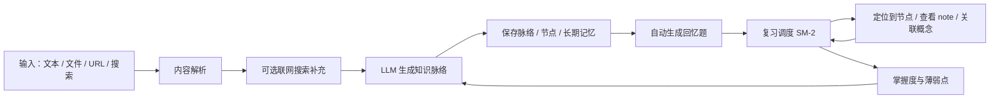
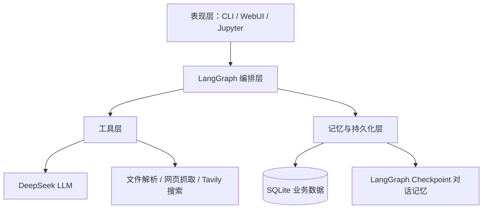
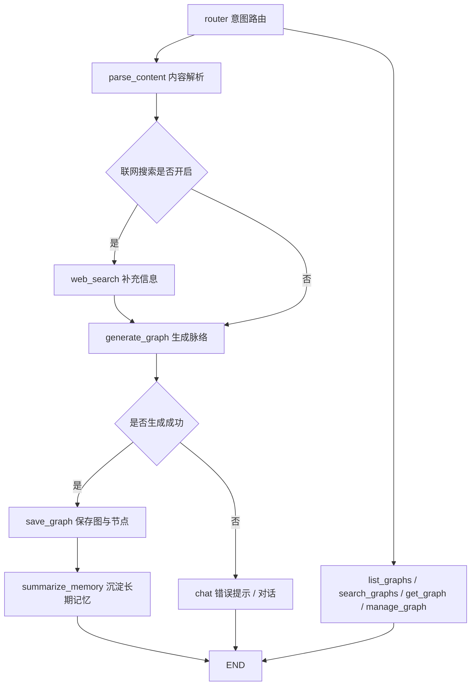
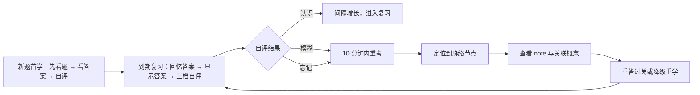
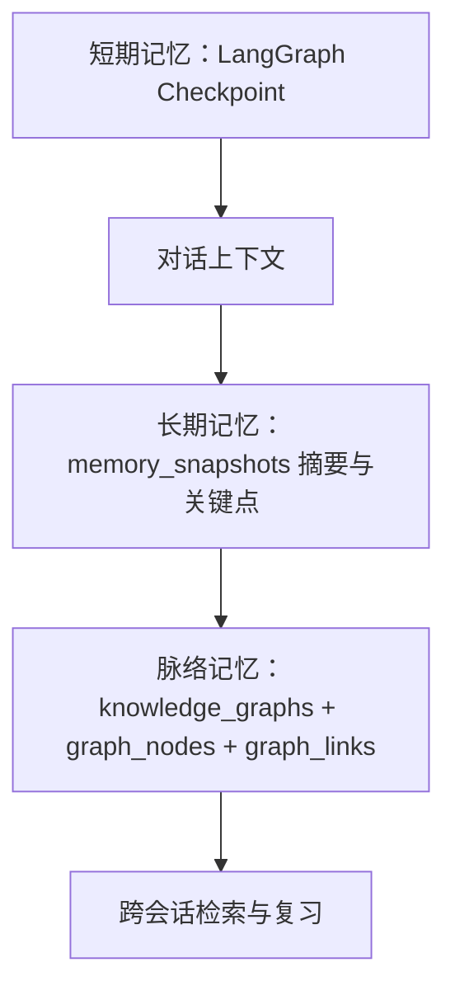

# 学习脉络智能体（Learning Context Agent）设计文档

> 版本：v1.0  
> 日期：2026-08-10  
> 范围：Agent 各组成部分的产品功能、核心逻辑与交互设计  
> 说明：文中「现状」指当前代码已实现，「目标」指下一阶段设计。本文件作为统一设计入口，具体执行细节见 `IMPLEMENTATION_PLAN.md`、`WEBUI_PLAN.md`、`WEBUI_V2_UPDATE.md`、`FEATURE_DESIGN_GRAPH_REVIEW.md`。

---

## 1. 产品定位与核心闭环

学习脉络智能体是一个把「知识结构化」和「复习调度」结合起来的个人学习助手。它的核心价值不是把内容变成一张静态图，而是让脉络图、回忆题、复习进度、薄弱点反哺形成闭环：



设计原则：

1. **图是空间，复习是时间**：脉络图回答「概念是什么、彼此什么关系」，复习回答「什么时候该巩固、哪里还没掌握」，两者互相驱动。
2. **一图多面**：同一份节点数据提供力导向图谱、层级树、流程图、大纲等多种视图，视图只换镜头，不改数据。
3. **学习行为可追踪**：掌握度、复习次数、答对率、连击、目标都由真实行为数据计算，不做静态占位。
4. **双入口一致**：CLI 与 WebUI 复用同一套 LangGraph、工具与数据层，能力保持对齐。

---

## 2. 总体架构



### 2.1 分层职责

| 层 | 模块 | 核心职责 |
| --- | --- | --- |
| 表现层 | `app/main.py`、`app/web/` | CLI 交互循环、FastAPI 路由、页面与前端组件 |
| 编排层 | `app/graph/` | AgentState、LangGraph 节点与条件路由、Mermaid/大纲解析 |
| 工具层 | `app/tools/` | 文档解析、网页抓取、联网搜索、脉络图 CRUD |
| 记忆层 | `app/memory/` | SQLite 建表、Repository、checkpoint saver |
| 提示词层 | `app/prompts/` | 系统 Prompt、脉络生成 Prompt、记忆摘要 Prompt |
| 模型服务 | DeepSeek | 脉络生成、问答、摘要、目标：LLM 出题与语义关联 |

### 2.2 主生成链路



---

## 3. 功能模块设计

### 3.1 输入与内容解析

#### 功能清单

| 输入方式 | 语法 / 交互 | 解析逻辑 | 现状 |
| --- | --- | --- | --- |
| 任意文本 | 直接输入 | 截断到 `MAX_CONTENT_LENGTH` 后进入生成链路 | 已实现 |
| 单个文件 | `file:路径`、WebUI 拖拽/选择 | TXT/MD 直接读，PDF/DOCX/IPYNB 按类型解析 | 已实现 |
| 批量文件 | `files:a;b` | 逐个解析，多文件之间加 `### 文件` 分隔 | CLI 已实现，WebUI 待补 |
| 单个 URL | `url:网址`、WebUI 输入 | 抓取网页正文并提取标题 | 已实现 |
| 批量 URL | `urls:a;b` | 逐个抓取，多 URL 之间加 `### 网址` 分隔 | CLI 已实现，WebUI 待补 |
| 联网搜索 | WebUI 开关 / CLI `/search on|off` | 开启时用前 200 字作为 query，把前 3 条结果并入生成上下文 | 已实现 |

#### 关键限制

- WebUI 单文件最大 50MB，内容解析上限约 8 万字符。
- 文件上传使用临时目录，解析完成后清理临时文件。
- 目标：增加 MIME/魔数校验、内网 URL 拦截、长文本先摘要再生成，避免解析安全与质量风险。

---

### 3.2 脉络图生成与表示形式

#### 3.2.1 生成逻辑

1. `router` 识别输入类型：`text`、`file`、`url`、`manage`、`search`、`chat`。
2. `parse_content` 把文件/URL/文本统一转成纯文本，并记录来源名。
3. `web_search` 在开关开启时补充外部信息。
4. `generate_graph` 调用 DeepSeek，按 Prompt 要求输出：
   - 图表类型：`flowchart LR`（过程）/ `graph TD`（层级）/ `mindmap`（发散）/ Markdown 大纲；
   - Mermaid 代码；
   - Markdown 大纲；
   - 节点数据 JSON（现状已支持，目标改为结构化输出）。
5. `save_graph` 保存图，并从节点 JSON 或 Mermaid/大纲解析结果落库节点。
6. `summarize_memory` 生成长期记忆摘要并写入 `memory_snapshots`。

#### 3.2.2 节点数据模型

生成时每个节点包含：

| 字段 | 说明 | 约束 |
| --- | --- | --- |
| `id` | 与 Mermaid 节点一致 | 必填 |
| `label` | 精简触发词，12 字以内 | 必填 |
| `note` | 1-3 句具体解释、关键句或例子 | 现状已支持，目标保证非空 |
| `node_type` | 概念 / 方法 / 案例 / 公式 / 结论 | `concept / method / case / formula / conclusion` |
| `parent_id` | 父节点，形成层级 | 可空 |
| `related_nodes` | 同图关联节点 id | 可空 |

节点类型同时驱动视觉和复习策略：

| 类型 | 示例 | 视觉 | 复习策略 |
| --- | --- | --- | --- |
| 概念 | 过拟合 | 蓝色 | 名词解释、判断 |
| 方法/算法 | 梯度下降 | 绿色 | 流程题、步骤填空 |
| 案例 | 猫狗分类 | 橙色 | 场景应用 |
| 公式/定义 | 交叉熵 | 紫色 | 填空、判断 |
| 结论/规则 | 偏差方差权衡 | 灰色 | 判断、关联题 |

#### 3.2.3 脉络图形式

| 形式 | 适用内容 | 呈现方式 | 交互 | 现状 |
| --- | --- | --- | --- | --- |
| 力导向图谱 | 概念关系复杂 | D3 力导向布局，节点按类型着色 | 节点拖动、点击查看 note、悬停提示 | 已实现 |
| Mermaid 流程图 | 过程、步骤、算法 | Mermaid SVG 渲染 | 缩放、平移、全屏、适应画布 | 已实现 |
| 大纲树 | 层级分类、目录结构 | 结构化层级树，可折叠 | 展开/收起、显示 note、搜索定位 | 已实现 |
| Markdown 原文 | 导出与溯源 | 原始大纲 | 导出 `.md` | 已实现 |
| 时间线 | 历史、演进脉络 | 横向时间轴 | 目标：按时间落位 | 待开发 |
| 对比矩阵 | 概念对比 | 行列矩阵 | 目标：交叉格对比要点 | 待开发 |
| 卡片流 | 快速浏览 / 睡前速览 | 单卡片翻页 | 目标：只看 label + note | 待开发 |

设计规则：

- 生成时由 Agent 判定 `graph_type`，自动推荐默认视图，用户可随时切换。
- 视图切换不改变节点和关联数据。
- 力导向图中 `related_nodes` 与 `graph_links` 统一合成关系边并去重。
- 目标：视图抽屉、节点搜索定位（Ctrl+F）、聚焦模式、最短关系路径查询。

#### 3.2.4 画布交互

- 工具栏：放大、缩小、适应画布、100%、全屏、导出。
- `Ctrl / Meta + 滚轮` 缩放，缩放范围 20%-300%。
- 按住画布拖拽平移。
- Mermaid 渲染失败时回退到原始代码并给出错误提示。
- 目标：Mermaid 语法校验 + 同参数重试一次。

---

### 3.3 节点与关联管理

#### 3.3.1 节点三层信息

```
第 1 层 · 速览：label + 节点类型徽标 + 掌握度色点
第 2 层 · 细读：note 具体内容，点击展开
第 3 层 · 深究：详情抽屉，包含关联关系、该节点题目、复习记录
```

#### 3.3.2 节点 CRUD

| 操作 | CLI 示例 | WebUI 交互 | 现状 |
| --- | --- | --- | --- |
| 新增 | `添加节点 <图ID> <文本>` | 节点面板填写 label/note/父节点/类型 | 已实现 |
| 修改 | `更新节点 <节点ID> <新文本>` | Modal 编辑 label/note/关联 | 已实现 |
| 删除 | `删除节点 <节点ID>` | Modal 二次确认 | 已实现 |
| 关联 | `关联节点 <节点ID> <id1,id2>` | 关联编辑弹窗 | 已实现 |
| 删除图 | `删除脉络图 <图ID>` | 历史列表删除入口 | CLI 已实现，WebUI 待补 |

#### 3.3.3 关联关系

现状存在两套数据：

- `graph_nodes.related_nodes`：同图节点 JSON 数组，作为快照/兼容字段。
- `graph_links`：支持图内与跨图关联的关系表，`from_graph_id == to_graph_id` 即为图内关联。

目标设计：统一以 `graph_links` 为唯一事实来源，写路径自动同步 `related_nodes`，读路径统一从 `graph_links` 聚合；删除节点时清理悬空引用；建立关联时保证双向对称。

关系类型与边样式：

| 关系 | 语义 | 边样式 |
| --- | --- | --- |
| `related` | 有关系但未细分 | 细实线 |
| `cause` | A 导致 B | 实线 + 箭头 |
| `include` | A 包含 B | 实线 + 空心箭头 |
| `contrast` | A 与 B 对立/比较 | 虚线 + 双向 |
| `extends` | A 是 B 的基础 | 带层级箭头 |
| `depends` | B 需要 A 才能理解 | 点线 |

目标交互：

- 点击节点进入聚焦模式，只显示一跳邻居与关系标签，其余淡出。
- 选择两个节点高亮最短关系路径，帮助建立联想链。
- 新增节点时实时联想相似已有节点，一键建立关联，替代手填 ID。
- 增删改进入撤销栈，删除关联前提示「该关联用于 X 道复习题」。

---

### 3.4 复习回顾

#### 3.4.1 出题引擎

现状：脉络保存后按节点生成模板题「什么是 XX」，题型固定为 `short_answer`，答案取 `note`，无 LLM 出题。

目标：由 LLM 按节点上下文结构化出题，覆盖六类题型：

| 题型 | 认知层次 | 例子 | 生成依赖 |
| --- | --- | --- | --- |
| 名词解释 | 记忆 | 什么是过拟合？ | label + note |
| 填空 | 记忆 | L2 正则化在损失函数中加入 ___ 惩罚项 | note 关键句挖空 |
| 判断 | 辨析 | 训练集表现好说明泛化好（对/错） | 易混淆点 |
| 选择 | 快速检验 | 四选一 | note + 关联概念做干扰项 |
| 关联题 | 关系理解 | 过拟合与正则化是什么关系？ | related / 关系类型 |
| 场景应用 | 迁移 | 验证集更差时先调什么？ | note + 父节点上下文 |

出题时机：

1. 脉络生成后自动出题（现状）。
2. 节点被编辑后自动重新出题（目标）。
3. 用户手动「换题 / 补题」（目标）。

题目绑定考点节点，答错次数累计为 `lapses`，用户手动编辑过的题目标记 `user_edited`，重新出题时不覆盖。

#### 3.4.2 复习流程



三档自评：忘记（0）/ 模糊（1）/ 认识（2）。答错不直接判死，先给一次「查看上下文后重答」的机会，仍错再进入重学序列。

#### 3.4.3 调度算法

现状为 SM-2 简化版，间隔约 1 / 3 / 7 / 14 / 30 天；目标替换为完整 SM-2 并预留 FSRS：

- 间隔序列：1 → 6 → 16 → 45 → 90 天，由 EF（易度因子）驱动。
- 忘记后立即重考：`due = now + 10 分钟`。
- 每日配额：新题不超过 10 道，到期题全部进入队列，逾期最久的优先。
- 容差窗口：到期 ±2 天内算按时复习。
- 连续 3 次忘记的题目降级为「重学」，重新走首学流程。

#### 3.4.4 复习与图的双向联动

| 联动点 | 设计 |
| --- | --- |
| 图 → 题 | 生成脉络后自动出题，节点详情内直接显示该节点题目 |
| 题 → 图 | 复习队列每题带「定位」按钮，跳转到对应脉络并高亮节点 |
| 错 → 补救 | 答错后自动展示关联概念面板，提示「相关概念也需要巩固」 |
| 图 → 薄弱 | 节点按掌握度着色，提供「只看未掌握」过滤 |
| 按图复习 | 每张图提供「从这张图开始复习」入口 |

#### 3.4.5 掌握度与激励体系

| 视觉元素 | 数据/逻辑 |
| --- | --- |
| 掌握度圆环 | 节点掌握度 = f(复习次数、最近表现、遗忘间隔)；图掌握度 = 节点加权平均 |
| 复习进度条 | 今日完成数 / 今日目标数 |
| 今日目标胶囊 | 默认 10 新题 + 当日到期题，用户可调 |
| 连击 | 每日完成目标 +1，中断清零 |
| 成就徽章 | 完成第一张脉络、连续 7 天、掌握 5 个概念等里程碑 |
| 遗忘预警 | 到期未复习的图显示提示，超过 7 天未复习自动降级掌握度 |

---

### 3.5 记忆与知识问答

#### 3.5.1 三层记忆



#### 3.5.2 知识问答

问答流程：

1. 对问题做关键词清洗。
2. 检索脉络标题/原文、节点 label/note、记忆摘要。
3. 把检索结果拼成上下文，交给 DeepSeek 回答。
4. 回答明确区分「已收录知识」与「知识库未直接覆盖，基于已有知识推理」，没有相关内容时不编造。

交互：WebUI 底部问答面板支持 `use_database` 开关，返回 `sources` 列表便于溯源。

---

### 3.6 历史、检索与数据管理

| 能力 | 交互 | 现状 |
| --- | --- | --- |
| 脉络历史 | WebUI 底部历史列表，按更新时间倒序 | 已实现 |
| 关键词搜索 | `search <关键词>`、WebUI 搜索框 | 已实现 |
| 主题回顾 | `回顾 <主题>` 进入复习检索 | 已实现 |
| 打开图 | `open <图ID>`、WebUI 点击历史项 | 已实现 |
| 标签筛选 | 按 `tags` 筛选 | 待开发 |
| 删除图 | CLI `删除脉络图 <图ID>` | CLI 已实现，WebUI 待补 |
| 分页 | 大列表分页加载 | 待开发 |

---

## 4. 交互设计

### 4.1 WebUI 布局

```
+------------------------------------------------------------------------------+
| 顶部：今日目标胶囊 / 联网搜索 / 输出格式 / 主题切换 / 状态                       |
+---------------+------------------------------+-------------------------------+
| 左栏：输入与资源 | 中央：脉络画布               | 右栏：节点与掌握度             |
| - 文本/文件/URL | - 力导向图谱 / Mermaid / 大纲 | - 掌握度圆环 / 进度条          |
| - 联网与格式   | - 缩放 / 平移 / 全屏 / 导出   | - 节点层级与类型徽标           |
| - 历史列表     | - 跨脉络跳转                 | - label / note / 关联编辑      |
+---------------+------------------------------+-------------------------------+
| 底部：复习队列 / 知识问答 / 长期记忆快照 / 统计                                 |
+------------------------------------------------------------------------------+
```

主要交互约定：

- 面板拖拽分隔条可调宽度/高度，尺寸记忆到 `localStorage`。
- 左/右/底部面板可折叠，移动端自动单列。
- `Ctrl+Enter` 生成，`Enter` 检索。
- 亮色 / 暗色主题切换并持久化。
- 操作结果通过 toast / 状态栏反馈，失败不静默。

### 4.2 CLI 命令

| 输入 | 说明 |
| --- | --- |
| 任意文本 | 生成并保存知识脉络图 |
| `file:路径` / `files:a;b` | 解析单个 / 批量文件 |
| `url:网址` / `urls:a;b` | 抓取单个 / 批量网页正文 |
| `list` / `search <关键词>` / `回顾 <主题>` | 列表 / 检索脉络 |
| `open <图ID>` | 查看脉络图与全部节点 |
| `添加节点` / `更新节点` / `删除节点` | 节点管理 |
| `关联节点 <节点ID> <id1,id2>` | 设置跨节点关联 |
| `/search on|off` | 联网搜索开关 |
| `/format mermaid|markdown|both` | 输出格式 |
| `/help` / `/quit` | 帮助 / 退出 |

### 4.3 核心用户旅程

#### 场景 A：学习新主题

1. 输入一篇笔记或上传文件 → 生成脉络 → 自动进入推荐视图。
2. 浏览：点击节点展开 note，查看节点类型与关联关系。
3. 系统提示已生成 N 道题 → 进入今日学习，先学 10 道新题。
4. 首学完成 → 今日目标推进、连击 +1、掌握度圆环出现数值。

#### 场景 B：复习日

1. 打开应用，顶部显示「今日目标：12 题待复习」→ 进入复习队列。
2. 第 3 题答「模糊」→ 显示答案 +「查看上下文」按钮。
3. 点击定位 → 跳转对应脉络并高亮节点及其关联。
4. 看关联概念后重答过关 → 回到队列继续。
5. 答完出成绩单：「答对 10/12，CAS 相关还需巩固，已加入明日复习」。

---

## 5. 数据模型设计

### 5.1 实体关系

```mermaid
erDiagram
    KNOWLEDGE_GRAPHS ||--o{ GRAPH_NODES : contains
    KNOWLEDGE_GRAPHS ||--o{ MEMORY_SNAPSHOTS : remembers
    KNOWLEDGE_GRAPHS ||--o{ QUIZ_QUESTIONS : has
    GRAPH_NODES ||--o{ GRAPH_LINKS : from
    GRAPH_NODES ||--o{ GRAPH_LINKS : to
    GRAPH_NODES ||--o{ QUIZ_QUESTIONS : tested_by
    QUIZ_QUESTIONS ||--o{ REVIEW_PROGRESS : scheduled
```

### 5.2 核心表

| 表 | 关键字段 | 职责 |
| --- | --- | --- |
| `knowledge_graphs` | id、title、graph_type、mermaid_code、markdown_outline、raw_content、source_type、tags | 脉络主表，保留原文溯源 |
| `graph_nodes` | id、graph_id、parent_id、label、note、node_type、related_nodes、order_index | 节点与层级 |
| `graph_links` | from/to graph+node、relation_type、note | 图内与跨图关系，目标作为唯一事实来源 |
| `memory_snapshots` | graph_id、summary、key_points | 长期记忆摘要 |
| `quiz_questions` | graph_id、node_id、question、answer、question_type、difficulty | 回忆题库 |
| `review_progress` | graph_id、node_id、quiz_id、status、repetitions、interval_days、ease_factor、due_at | SM-2 调度状态 |

### 5.3 目标增量表

| 表 | 用途 |
| --- | --- |
| `node_mastery` | 节点掌握度缓存：score、level、updated_at |
| `daily_stats` | 每日目标、完成数、连击、正确率 |
| `achievements` | 成就解锁记录 |
| `study_sessions` | 学习/复习/测试会话、成绩单、补救复习单 |

---

## 6. 关键逻辑与算法

### 6.1 意图路由

| 输入特征 | action |
| --- | --- |
| 空输入 / 普通对话 | `chat` |
| `list` / `列表` | `list_graphs` |
| 添加/更新/删除/关联节点、删除图 | `manage_graph` |
| `open` / `打开` / `查看脉络` | `get_graph` |
| `search` / `搜索` / `回顾` / `复习` | `search_graphs` |
| `file:` / `files:` / `文件:` | `parse_file` |
| `url:` / `urls:` / `http://` | `parse_url` |
| 其余文本 | `generate_graph` |

### 6.2 SM-2 调度

目标公式：

```text
复习成功：
  repetitions += 1
  EF = max(1.3, EF + (0.1 - (5 - q) * (0.08 + (5 - q) * 0.02)))
  interval = 1            # repetitions == 1
  interval = 6            # repetitions == 2
  interval = round(interval * EF)  # repetitions > 2

忘记 / 模糊：
  repetitions = 0
  EF = max(1.3, EF - 0.15)
  due = now + 10 分钟
  status = learning
```

### 6.3 掌握度

目标口径：

```text
节点掌握度 = 基础分数 × 复习次数衰减权重 × 最近表现权重 × 遗忘衰减
图掌握度 = 节点掌握度加权平均
超过 7 天未复习 → 自动降级
```

### 6.4 自动关联

现状：字符集合 Jaccard 相似度 `>= 0.5` 即建 `related` 链接。

目标：两阶段：

1. 候选召回：字符重叠 + note 关键词命中，候选数限制在 20 以内。
2. 语义确认：把候选批量交给 LLM，输出 `{from, to, relation_type, confidence}`，仅 `confidence >= 0.6` 落库。

---

## 7. API 设计概览

| 方法 | 路径 | 用途 |
| --- | --- | --- |
| `POST` | `/api/v1/graphs/generate` | 生成并保存脉络 |
| `POST` | `/api/v1/graphs/parse` | 文件 / URL / 文本预解析 |
| `GET` | `/api/v1/graphs` | 列表 + 关键词检索 |
| `GET` | `/api/v1/graphs/{id}` | 图详情 + 节点 |
| `GET` | `/api/v1/graphs/{id}/outline` | 结构化大纲树 |
| `PATCH` / `DELETE` | `/api/v1/graphs/{id}` | 更新 / 删除图 |
| `POST` | `/api/v1/nodes` | 新增节点 |
| `PATCH` / `DELETE` | `/api/v1/nodes/{id}` | 修改 / 删除节点 |
| `GET` / `POST` / `DELETE` | `/api/v1/links` | 跨图/图内关联 |
| `GET` / `POST` | `/api/v1/quiz` | 题库列表 / 手动出题 |
| `GET` | `/api/v1/review` | 今日复习队列与统计 |
| `POST` | `/api/v1/review/{id}` | 提交复习反馈 |
| `POST` | `/api/v1/ask` | 知识问答 |
| `GET` | `/api/v1/memories` | 长期记忆快照 |

统一响应结构：`{ "ok": bool, "data": ..., "error": ... }`。

---

## 8. 现状与演进路线

### 8.1 功能状态矩阵

| 能力 | 状态 |
| --- | --- |
| 文本 / 文件 / URL / 批量输入 | 已实现 |
| 联网搜索开关与格式选择 | 已实现 |
| Mermaid / 大纲 / 力导向图谱三视图 | 已实现 |
| 节点 CRUD、note、类型、关联编辑 | 已实现 |
| 自动跨脉络关联与跳转 | 已实现（规则版，语义化待升级） |
| 自动出题与复习队列、SM-2 简化版 | 已实现（LLM 出题待升级） |
| 长期记忆与知识问答 | 已实现 |
| 掌握度模型、每日目标、连击、成就 | 待开发 |
| 时间线 / 对比矩阵 / 卡片流视图 | 待开发 |
| 完整 SM-2 / FSRS | 待开发 |
| 会话隔离、撤销重做、标签筛选 | 待开发 |

### 8.2 演进阶段

| 阶段 | 重点 | 验收 |
| --- | --- | --- |
| Phase 1：图先活起来 | 节点三层信息、类型徽标、力导向视图、关系类型化、聚焦模式、节点定位 | 大图可浏览、可聚焦、关系可理解 |
| Phase 2：题先真起来 | LLM 出题、学习/复习分离、答错定位、完整 SM-2 | 题目有来路、复习有反馈 |
| Phase 3：学得看得见 | 掌握度、每日目标、连击、成就、统计卡、遗忘预警 | 激励全部由真实数据驱动 |
| Phase 4：进阶 | 测试模式、成绩单、补救复习单、路径查询、FSRS | 形成完整学习闭环 |

---

## 9. 非功能设计

1. **本地优先**：默认监听 `127.0.0.1`，SQLite 本地存储，无网络也能查看历史与复习数据。
2. **安全性**：上传类型校验、URL SSRF 防护、Mermaid 渲染输出清洗、登录扩展层预留。
3. **可靠性**：LLM 统一封装重试/超时、结构化输出 + 正则兜底、Mermaid 语法校验重试、错误不静默。
4. **性能**：目标 FTS5 全文检索、列表摘要接口、生成异步化与轮询进度。
5. **可扩展性**：输入源插件注册、前端组件 + 事件总线、API 版本化、Repository 与 service 分层。
