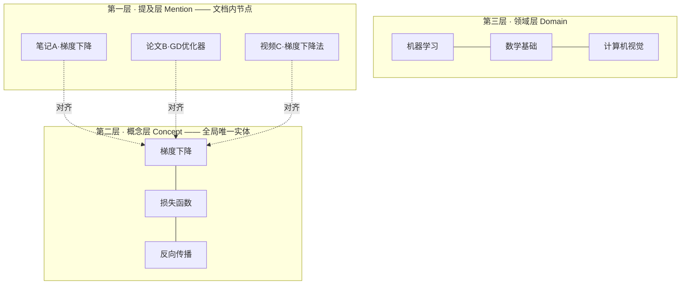
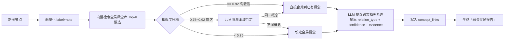
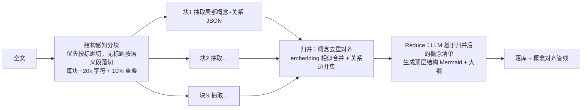

# 学习脉络智能体设计文档 v2.0 —— 从「单文档脉络」到「全局知识网络」

> 版本：v2.0
> 日期：2026-08-10
> 前置：本文档取代 v1.0 设计文档；v1.0 中未被本文推翻的内容（节点 CRUD、CLI/WebUI 双入口、SQLite 数据层、API 规范等）继续有效。
> 本次重构针对三个核心问题：
> 1. 脉络图局限于单一文件，缺乏"融会贯通"的全局知识网络效果；
> 2. 复习回顾只是卡片流复用，体验单薄；
> 3. 文件上传上下文过小（80,000 字符硬截断），长文档信息丢失。

---

## 0. v2.0 核心理念转变

| 维度 | v1.0（现状） | v2.0（目标） |
| --- | --- | --- |
| 数据中心 | 以「图」为中心，节点隶属于单张图 | 以「概念」为中心，图只是概念网络的一个切面 |
| 关联方式 | 生成后按字符相似度做事后规则关联 | 生成时做概念对齐（embedding + LLM 消歧），关联是一等公民 |
| 图的形态 | 每份文件一张孤立脉络图 | 一张持续生长的全局知识星图 + 按需投影的文档视图 |
| 复习形态 | 模板问答卡片流 | 多模态复习：图回忆 / 费曼讲述 / 苏格拉底对话 / 跨文档综合 / 叙事简报 |
| 长文处理 | 截断到 8 万字符 | 结构感知分块 → Map-Reduce 抽取 → 全局归并，不丢信息 |

一句话概括 v2.0：**每一次学习输入，都不是"新建一张图"，而是"向你毕生的知识网络中注入新节点并点亮新连接"。**

---

## 1. 全局知识网络（核心重构）

### 1.1 问题分析

v1.0 的结构性缺陷：

- `graph_nodes.graph_id` 使节点天然被"关"在单张图里，跨图关系（`graph_links`）是补丁而非骨架。
- 同一概念在不同文档里生成多次（如"梯度下降"出现在三份笔记中），彼此是三个无关节点，网络无法收敛。
- 力导向图每次只渲染一张图的节点，视觉上永远是"孤岛"，不可能出现网状融会贯通的效果。

### 1.2 三层知识模型

引入**全局概念层（Concept Layer）**，位于文档图之上：



| 层 | 实体 | 说明 |
| --- | --- | --- |
| 提及层 Mention | `graph_nodes`（保留） | 概念在某份文档中的具体出现，携带该文档语境下的 note，永远保留溯源 |
| 概念层 Concept | `concepts`（新增） | 全局唯一的知识实体，聚合所有 mention，是关系边、掌握度、复习的真正挂载点 |
| 领域层 Domain | 社区检测自动生成 | 由图算法对概念网络聚类得到（如"机器学习""线性代数"），用于星图着色与缩放分层 |

### 1.3 概念对齐管线（融会贯通的引擎）

每次生成脉络后新增 `align_concepts` 节点，替代 v1.0 的"Jaccard ≥ 0.5 建链"：



关键设计：

1. **向量化**：DeepSeek 不提供 embedding API，引入本地嵌入模型（推荐 `bge-m3` 或 `bge-small-zh-v1.5`，CPU 可跑），向量存 SQLite + `sqlite-vec` 扩展（零额外部署，符合本地优先原则）。
2. **消歧证据**：LLM 消歧时同时给出两个 mention 的 note 与父节点上下文，要求输出 `{same_concept: bool, canonical_label, reason}`，防止"注意力（心理学）"与"注意力（Transformer）"被错误合并。
3. **关系边带证据**：`concept_links` 每条边记录 `evidence`（来自哪份文档的哪句话）与 `confidence`，低置信边在图上以浅色虚线呈现，用户可一键确认/否决——用户反馈回流为高置信边。
4. **对齐可撤销**：概念合并记录在 `concept_merges` 表，误合并可拆分还原。

### 1.4 融会贯通时刻（Aha Moment）

这是 v2.0 最重要的产品体验：**每次生成脉络后，系统显式报告新知识与旧知识的连接**。

生成结果页新增「本次融会贯通」面板：

```
✨ 本次学习与你已有的知识建立了 5 条新连接：

  · [新] 交叉熵损失 ──(公式来源)── [已学·信息论笔记] 信息熵
  · [新] Softmax ──(前置依赖)── [已学·线代笔记] 指数归一化
  · [强化] 梯度下降：第 3 次在不同材料中出现，本次补充了"动量"视角
  ...

  你的知识网络：217 个概念，48 条新边，「机器学习」领域与「信息论」领域首次连通！
```

这直接回应"串通毕生所学"的诉求：连接不再是用户翻图时偶然发现的，而是每次学习的**显式产出**。

### 1.5 全局知识星图（Galaxy View）

新增最高优先级视图，替代"单图力导向"成为默认首页：

| 设计点 | 说明 |
| --- | --- |
| 全量渲染 | 渲染所有 `concepts` + `concept_links`，而非单图节点 |
| 语义缩放 | 缩到最小：只显示领域聚类气泡（社区检测 Louvain/Leiden）；中等：显示高连接度枢纽概念；放大：显示全部概念与关系标签 |
| 视觉编码 | 颜色 = 领域；大小 = 连接度（度中心性）；光晕 = 掌握度（绿=牢固 / 黄=模糊 / 红=遗忘 / 灰=未复习）；边样式 = 关系类型（沿用 v1.0 的六类关系样式） |
| 渲染引擎 | ≤ 500 节点继续用 D3-force；> 500 节点切换 WebGL 渲染（sigma.js / cosmograph），保证千级节点流畅 |
| 交互 | 单击聚焦一跳邻居（其余淡出）、双击进入概念详情抽屉、Ctrl+F 搜索定位飞行、框选批量操作、时间滑块回放"知识网络生长动画" |
| 知识链路 | 选中任意两个概念 → 高亮最短路径 → LLM 生成一段"知识链路解说"（如"从傅里叶变换到 JPEG 压缩，你的知识是这样连起来的：…"） |
| 暗区提示 | 孤立概念（度=0）和低掌握度区域以视觉暗区呈现，点击可发起"补链学习"或"专项复习" |

单文档脉络视图（v1.0 的力导向/Mermaid/大纲）全部保留，但每个节点增加**全局徽标**：`⛓ 3` 表示该概念还出现在另外 3 份材料中，点击展开跨文档邻居并可跳转。

### 1.6 数据模型增量

```mermaid
erDiagram
    CONCEPTS ||--o{ GRAPH_NODES : "mention 对齐"
    CONCEPTS ||--o{ CONCEPT_LINKS : from
    CONCEPTS ||--o{ CONCEPT_LINKS : to
    CONCEPTS ||--o{ CONCEPT_ALIASES : "别名"
    CONCEPTS ||--o{ QUIZ_QUESTIONS : "考点迁移到概念"
    CONCEPTS ||--o{ NODE_MASTERY : "掌握度迁移到概念"
    KNOWLEDGE_GRAPHS ||--o{ GRAPH_NODES : contains
    KNOWLEDGE_GRAPHS ||--o{ CONTENT_CHUNKS : "原文分块"
```

| 表 | 关键字段 | 职责 |
| --- | --- | --- |
| `concepts` | id、canonical_label、summary、domain_id、embedding、mention_count、created_at | 全局概念实体；`summary` 由多个 mention 的 note 归并生成 |
| `concept_aliases` | concept_id、alias | 别名/同义词（"GD"、"梯度下降法"） |
| `concept_links` | from_concept、to_concept、relation_type、confidence、evidence、source（llm/user）、status（pending/confirmed/rejected） | 全局关系边，唯一事实来源；v1.0 的 `graph_links` 迁移入此 |
| `concept_merges` | winner_id、loser_id、merged_at | 合并审计，支持拆分还原 |
| `domains` | id、name、color、concept_count | 社区检测结果缓存，定期重算 |
| `graph_nodes`（改） | + `concept_id` 外键 | mention 挂载到概念 |
| `content_chunks` | graph_id、chunk_index、text、embedding、char_range | 原文分块与向量（见第 3 章） |

**迁移策略**：写一个一次性脚本，对存量 `graph_nodes` 全量跑一遍概念对齐管线，把历史孤岛图自动融入全局网络——老用户第一次升级就能看到"星图点亮"的效果。

---

## 2. 复习回顾重设计（从翻卡到多模态体验）

### 2.1 问题分析

v1.0 复习 = 模板题（"什么是 XX"）+ 卡片流翻页，本质是生成物的复用，缺少：认知层次差异、与图的深度互动、跨文档综合、以及"被理解的感觉"。

### 2.2 复习模式矩阵

复习不再是单一队列，而是按认知目标提供六种模式，调度器按题目状态与用户偏好混合编排：

| 模式 | 玩法 | 考察层次 | 数据依赖 |
| --- | --- | --- | --- |
| **闪卡问答**（保留升级） | LLM 出题的六类题型（名词解释/填空/判断/选择/关联/场景），替换模板题 | 记忆 | concept + note |
| **图回忆 Graph Recall** | 把某张脉络图挖空 30%：节点变"？"遮罩或关系边断开，用户点击回忆填空，答对节点原位点亮 | 结构记忆 | 图拓扑 |
| **连线题** | 左列概念、右列解释/例子/关系对象，拖拽连线，错误连线红色抖动 | 辨析 | concept_links |
| **费曼讲述** | "用你自己的话讲讲『反向传播』"，用户输入自由文本，LLM 对照 summary + 关联边评分，指出讲对的、讲漏的、讲错的 | 深度理解 | concept 全上下文 |
| **苏格拉底追问** | 对话式复习：LLM 从一个到期概念出发沿关系边追问 3-5 轮（"既然 L2 正则约束权重，那它和贝叶斯先验有什么关系？"），可随时求提示 | 关系推理 | 概念邻域子图 |
| **跨文档综合题** | 专门基于 `concept_links` 中**跨文档边**出题："你在《信息论》学过熵，在《ML 笔记》学过交叉熵损失，请解释后者为什么用前者定义"——这是融会贯通在复习侧的直接体现 | 迁移综合 | 跨文档 concept_links |

**惊喜感设计原则**：同一概念每次到期，模式与题目都不完全相同——出题引擎带随机扰动与"模式轮换"，第 1 次可能是闪卡、第 2 次是图回忆、第 3 次是费曼讲述，避免"见过这张卡"的疲劳。

### 2.3 每日复习简报（叙事化复习）

每天首次打开应用，不直接甩队列，而是生成一份**今日知识简报**：

```
📮 早上好，今天有 12 个概念到期。

它们恰好能串成一条线：从「贝叶斯定理」出发，经过「先验/后验」，
到你上周学的「L2 正则 = 高斯先验」——今天的复习将沿着这条链走一遍。

⚠ 预警：「傅里叶变换」已 9 天未复习，遗忘概率 72%，已插入今日队列。
🌑 暗区：「计算机网络」领域整体掌握度跌破 50%。

[开始今日复习 →]   [只看薄弱项 →]   [换一条知识链 →]
```

实现：调度器取出今日到期概念 → 在概念图上找连通子图/最短生成路径 → LLM 把路径写成 3-5 句导语 → 复习题按路径顺序编排。到期概念彼此不连通时退化为按领域分组。

### 2.4 复习结算与记忆可视化

- **成绩单**：正确率、用时、薄弱概念清单、"较上次进步"对比。
- **记忆曲线**：每个概念展示个人遗忘曲线（历次复习点 + 预测衰减线），让用户"看见"间隔重复在起作用。
- **星图热力回放**：复习结束后星图上被巩固的节点绿色脉冲点亮——复习行为直接反映在知识网络视觉上，强化"我在维护我的知识宇宙"的心智。

### 2.5 调度算法：直接上 FSRS

v1.0 计划"完整 SM-2 并预留 FSRS"，v2.0 建议**跳过完整 SM-2，直接采用 FSRS**（`py-fsrs` 开源库，MIT）：

- FSRS 基于记忆三变量模型（难度/稳定性/可提取性），预测精度显著优于 SM-2，且有现成 Python 实现，接入成本不高于自写完整 SM-2。
- 评分沿用四档（忘记/困难/模糊/掌握），映射 FSRS 的 again/hard/good/easy。
- 保留 v1.0 的每日新题配额、10 分钟重考、重学降级机制。
- 掌握度口径统一为 FSRS 的 `retrievability`（可提取性），不再自定义衰减公式——星图光晕、暗区、预警全部读这一个值。

### 2.6 出题引擎升级

- 出题从"每节点一道模板题"改为**按概念出题**：一个概念的题目池覆盖多种题型与模式，绑定 `concept_id`（跨文档共享复习进度，同一概念不再因出现在三份文档里被考三遍）。
- LLM 结构化出题：使用 JSON 输出（DeepSeek `response_format: json_object`），schema 校验失败自动重试一次，彻底替代正则解析。
- 干扰项质量：选择题干扰项从**图上邻近概念**中选（同领域、有边相连的易混概念），比随机干扰项更有辨析价值。
- 出题时机沿用 v1.0（生成后 / 节点编辑后 / 手动换题），新增：**跨文档边确认后自动生成综合题**。

---

## 3. 长文本管道（解决 8 万字符截断）

### 3.1 问题分析

现状 `nodes.py` 对解析内容 `[:MAX_CONTENT_LENGTH]` 硬截断：一本 300 页 PDF 只有前 ~8 万字符参与生成，后 80% 内容静默丢失，且用户无感知。deepseek-chat 上下文 128K tokens，理论可容纳更多，但"一次塞满"既贵又降低生成质量（长上下文中部注意力衰减）。

### 3.2 分级处理策略

按内容长度自动分级，用户无需选择：

| 级别 | 长度（字符） | 策略 |
| --- | --- | --- |
| S | ≤ 30,000 | 现有单次生成链路，不变 |
| M | 30,000 ~ 150,000 | **Map-Reduce 两遍法**（见 3.3） |
| L | > 150,000（整本书/课程） | **结构感知章节化**（见 3.4） |

`MAX_CONTENT_LENGTH` 语义从"截断上限"改为"单次 LLM 调用的分块上限"，任何长度的输入都全量处理。

### 3.3 Map-Reduce 两遍法（M 级）



- Map 阶段各块**并行调用**（asyncio），耗时 ≈ 单块耗时而非线性累加。
- Map 只输出结构化 JSON（概念/关系/note/原文位置），不生成 Mermaid；Mermaid 只在 Reduce 阶段基于全局视野生成一次，避免各块风格不一致。
- 块间重叠 10% 防止概念被切断；归并阶段复用第 1.3 节的对齐逻辑（同一套代码，作用域是"块间"而非"图间"）。
- WebUI 显示分块进度条（"正在解析第 4/9 块…"），生成异步化 + 轮询（呼应 v1.0 性能目标）。

### 3.4 结构感知章节化（L 级）

整本书 / 完整课程讲义：

1. 先抽取目录结构（PDF 书签 / Markdown 标题树 / LLM 识别章节边界）。
2. 生成**母图**：全书章节级脉络（每章一个节点）。
3. 每章独立走 M 级管线生成**子图**，子图挂在母图章节节点下（`knowledge_graphs` 增加 `parent_graph_id`）。
4. 用户可选"全书处理"或"只处理选中章节"（成本提示：预估 token 消耗与耗时）。
5. 所有子图节点照常进入全局概念对齐——书内跨章的概念也会连通。

### 3.5 原文分块入库（RAG 化）

无论哪个级别，原文都切块存入 `content_chunks`（文本 + embedding + 字符区间）：

- **问答升级**：知识问答从"检索图标题/节点"升级为"向量检索原文块 + 概念图双路召回"，回答质量和溯源精度大幅提升，`sources` 可精确到原文段落。
- **note 溯源**：节点详情里"查看原文"跳到具体段落，而非整篇 raw_content。
- **出题素材**：填空题/场景题可直接引用原文关键句。

### 3.6 其他上下文相关修复

- 联网搜索 query 从"前 200 字"改为"LLM 先对内容提炼主题词再搜索"，长文场景下前 200 字往往是封面/目录，搜不到有效补充。
- 上传大小限制 50MB 保留，但增加解析前预估提示："该文件约 45 万字，将分 23 块处理，预计 6 分钟 / 约 x 万 tokens"。
- MIME/魔数校验、内网 URL 拦截（v1.0 目标项）在本阶段一并落地。

---

## 4. 其他优化建议（本次新增）

### 4.1 学习路径规划（Learning Path）

概念图中已有 `depends` / `extends` 依赖边，可直接产出高价值功能：

- 用户选定目标概念（"我想搞懂 Diffusion Model"）→ 在概念图上反向拓扑排序 → 生成有序学习路径，标注每步的掌握状态："你已掌握 3/7 个前置，还差『变分推断』和『马尔可夫链』"。
- 路径中的"未学习"概念可一键触发联网搜索 + 生成入门脉络——Agent 从"整理已学"进化为"引导去学"。

### 4.2 知识周报（自动生成）

每周日生成推送式周报：本周新增概念数 / 新连接数、星图生长动画 GIF、掌握度变化 Top5、最活跃领域、下周复习压力预测。这是激励体系（连击/成就）之上更"有内容"的正反馈。

### 4.3 输入源扩展

| 来源 | 方式 | 优先级 |
| --- | --- | --- |
| 视频字幕 | B 站 / YouTube 链接 → 拉字幕 → 走文本管线 | 高（学习场景高频） |
| Obsidian / 本地笔记库 | 指定 vault 目录批量导入 + 增量监听 | 高 |
| 剪贴板速记 | 全局快捷键把选中文字发给 Agent"稍后整理"收件箱 | 中 |
| Anki 导出 | 导出 `.apkg`，把题库带去 Anki 生态 | 中 |
| 图片/白板照片 | OCR（DeepSeek 无视觉能力，需接视觉模型或本地 PaddleOCR） | 低 |

### 4.4 工程质量项

1. **结构化输出全面化**：所有 LLM 调用（生成/消歧/出题/评分）统一 JSON schema + 校验重试，删除正则兜底路径。
2. **服务分层**：概念对齐、出题、调度逻辑从 graph nodes 中抽出为独立 service，LangGraph 节点只做编排——否则 v2.0 的管线复杂度会让 `nodes.py` 失控。
3. **成本与限速**：Map-Reduce 并行调用需要全局 LLM 并发闸门与 token 预算统计，设置每日 token 预算提醒。
4. **FTS5 + sqlite-vec**：关键词检索走 FTS5，语义检索走 sqlite-vec，双路召回合并。
5. **数据可迁移**：概念层引入后提供全量导出（JSON + 向量），保证"毕生知识网络"不被锁死在单机 SQLite。
6. **测试基线**：概念对齐是 v2.0 的正确性核心，建立"消歧金标集"（50 对应合并/50 对不应合并的样例）做回归测试。

---

## 5. 演进路线（v2.0 重排）

| 阶段 | 重点 | 关键交付 | 验收标准 |
| --- | --- | --- | --- |
| **Phase 1：概念层奠基** | `concepts`/`concept_links` 建表、embedding 接入（bge + sqlite-vec）、概念对齐管线、存量数据迁移脚本 | 新旧文档节点自动对齐到全局概念 | 上传两份相关笔记，重叠概念自动合并且跨文档边 ≥ 3 条 |
| **Phase 2：星图与融会贯通** | Galaxy View（语义缩放/领域聚类/掌握度光晕）、融会贯通报告、知识链路解说、单图视图加全局徽标 | 全局知识星图成为默认首页 | 200+ 概念时星图流畅、每次生成都展示新连接报告 |
| **Phase 3：长文本管道** | 分级策略、Map-Reduce 并行抽取、章节化母子图、content_chunks + RAG 问答、异步进度 | 整本 PDF 全量处理不截断 | 30 万字符文档生成的概念覆盖前中后各章节 |
| **Phase 4：复习体验** | FSRS 接入、LLM 出题、图回忆/连线/费曼/苏格拉底/跨文档综合五种新模式、每日简报、记忆曲线 | 复习不再是单一卡片流 | 同一概念连续三次复习出现 ≥ 2 种不同模式 |
| **Phase 5：进阶** | 学习路径规划、知识周报、视频/Obsidian 输入源、Anki 导出、成就与激励 | 从"整理工具"到"学习伙伴" | 完整闭环：输入 → 连接 → 复习 → 路径 → 周报 |

> 排序理由：概念层是星图、跨文档复习、学习路径的共同地基，必须最先落地；长文本管道独立性强，可与 Phase 2 并行；复习体验依赖概念层（按概念出题）故排后；v1.0 的 Phase 3（掌握度/激励）大部分被 FSRS retrievability 和周报吸收。

---

## 6. 风险与对策

| 风险 | 影响 | 对策 |
| --- | --- | --- |
| 概念误合并（"注意力"心理学 vs Transformer） | 知识网络污染，信任崩塌 | 灰区必走 LLM 消歧 + 合并可撤销 + 低置信边待确认状态 + 消歧金标回归测试 |
| 星图节点过多变"毛线球" | 全局视图失去可读性 | 语义缩放分层 + 领域聚类气泡 + 默认只显示 confidence ≥ 0.6 的边 + 聚焦模式 |
| Map-Reduce 成本失控 | 一本书消耗数十万 tokens | 处理前成本预估确认 + 章节级按需处理 + 每日 token 预算 |
| 本地 embedding 拖慢低配机器 | 生成变慢 | bge-small 量化版兜底；提供"关闭语义对齐，退回规则关联"降级开关 |
| 复习模式多导致上手复杂 | 新用户困惑 | 默认只开闪卡+图回忆，其余模式随复习次数渐进解锁（本身也是成就感设计） |
