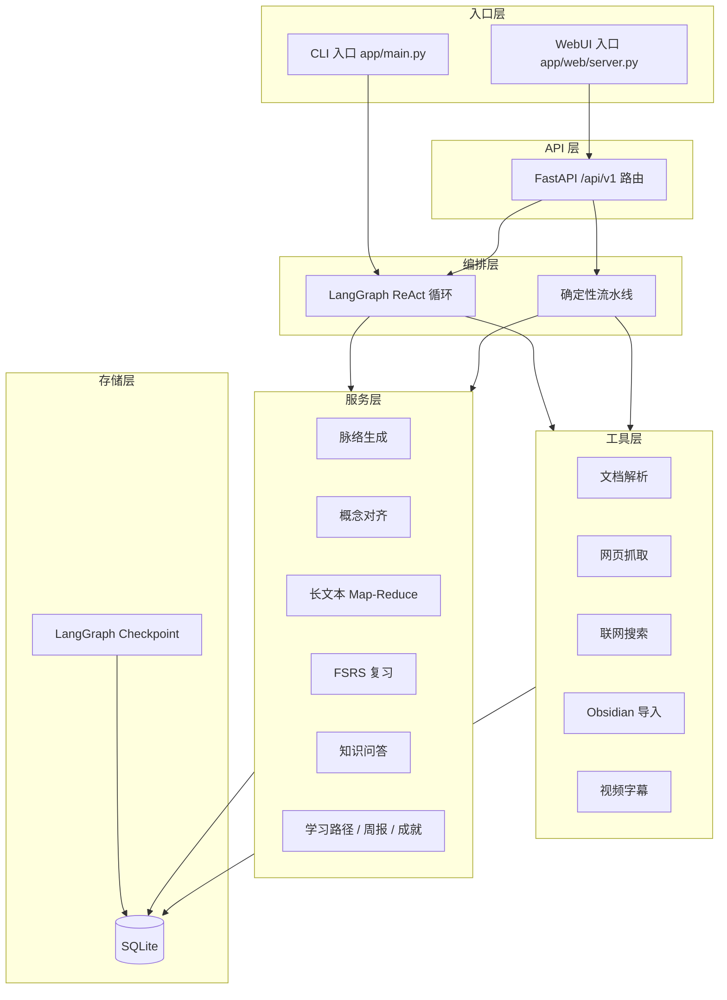
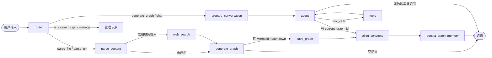
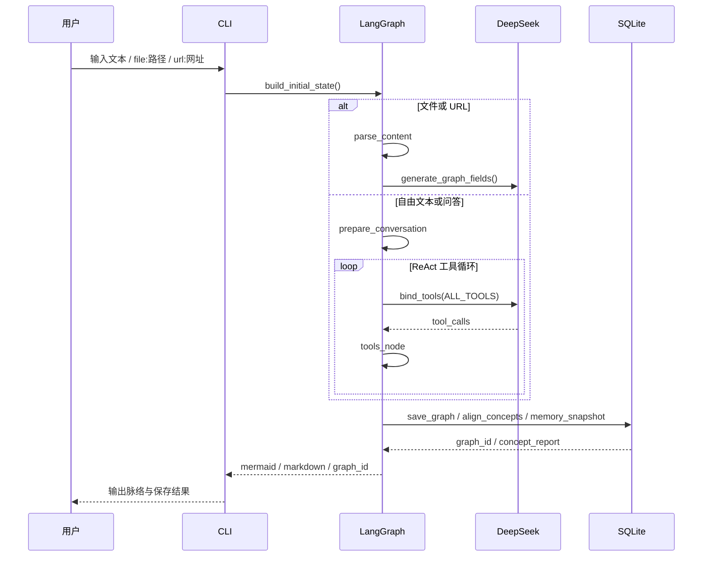
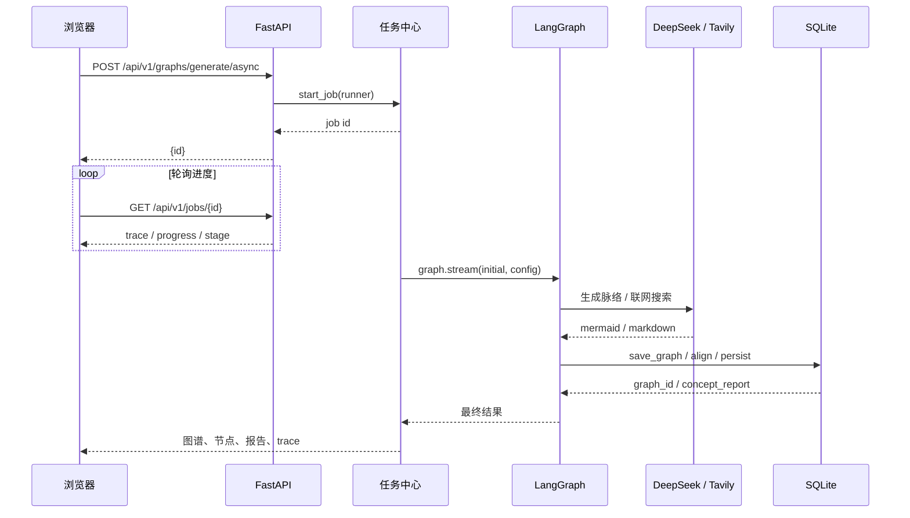
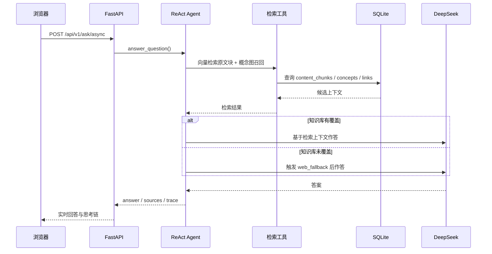
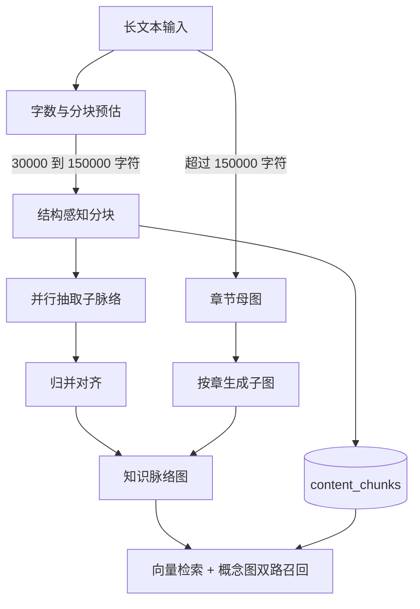

# 学习脉络智能体 (Learning Context Agent)

基于 LangGraph + DeepSeek + SQLite 的智能学习助手：把文本、文件、URL、视频字幕或
Obsidian Vault 整理成 Mermaid / Markdown 知识脉络，支持节点级关联、全局概念对齐、
长期记忆、FSRS 复习调度与知识问答。

## 功能特性

- 多入口输入：自由文本、本地文件（TXT/MD/PDF/DOCX/IPYNB）、URL、视频字幕、Vault 批量导入
- 混合编排：LangGraph ReAct 自由决策 + 确定性流水线（解析 → 生成 → 保存 → 对齐 → 记忆）
- 三层知识模型：文档提及层、全局概念层、领域层
- 长文本管道：Map-Reduce 分块抽取，整本书自动生成章节母图与子图
- 复习体系：FSRS 记忆三变量模型，闪卡、图回忆、连线、费曼、追问、跨文档六种模式
- 学习闭环：学习路径、知识周报、成就体系、Anki 导出
- WebUI：力导向图谱、Mermaid、大纲树、全局知识星图四种可视化视图

## 快速开始

环境要求：Python >= 3.13，并安装 [uv](https://docs.astral.sh/uv/)。

```bash
uv sync
uv run python -m app.main
```

首次使用前，在项目根目录的 `.env` 中写入：

```dotenv
DEEPSEEK_API_KEY=your-deepseek-api-key
TAVILY_API_KEY=your-tavily-api-key
```

CLI 启动后会进入交互式命令模式，输入 `/quit` 退出。

## WebUI

```bash
uv run python -m app.web.server
```

浏览器打开 <http://127.0.0.1:8000>。如需自定义端口，可把端口号作为参数传入：

```bash
uv run python -m app.web.server 8765
```

界面采用三栏布局：

- 左栏：文本 / 文件拖拽上传 / URL 抓取 / 联网搜索与输出格式
- 中央：力导向图谱 / Mermaid / 大纲树三视图切换，支持缩放、平移、全屏
- 右栏：掌握度圆环、节点层级与类型徽标、展开查看具体内容、跨脉络跳转
- 底部：脉络历史检索、今日复习队列、知识问答、长期记忆快照
- 顶部：今日目标胶囊、亮色与暗色主题切换

文件上传支持 TXT / MD / PDF / DOCX / IPYNB，单文件不超过 50MB，单次内容解析上限约
8 万字符；旧图会自动从 Mermaid / 大纲补全节点。当前 WebUI 仅监听 `127.0.0.1`，
暂不启用登录，认证扩展层已预留。

## UI 截图

WebUI 完整截图统一放在 [docs/ui-screenshots.md](docs/ui-screenshots.md)，包含首页、
知识星图、脉络图、复习、长期记忆与知识问答等界面。点击链接即可在 GitHub 上打开
图片文档。

## 项目框架



各层职责：

- `app/web/`：FastAPI 应用、业务路由、请求 Schema、前端静态资源
- `app/graph/`：LangGraph 状态、节点、图组装，以及 Mermaid / Markdown 结构解析
- `app/services/`：脉络生成、概念对齐、长文本、复习、知识问答等业务逻辑
- `app/tools/`：文档、网页、搜索、图谱 CRUD、Vault 导入、视频字幕等能力
- `app/memory/`：SQLite 连接、DDL 模型、仓储实现与 checkpoint
- `data/learning_agent.db`：运行时生成的 SQLite 数据库

## 核心流程



## 时序图

### CLI 生成脉络



### WebUI 异步生成



### 知识问答



## 长文本管道



超过 3 万字符自动进入 Map-Reduce，不再硬截断；超过 15 万字符的整本书会先建立章节
母图，再按章生成子图。原文分块全部进入 `content_chunks`，知识问答升级为「向量检索
原文块 + 概念图双路召回」。

## 数据模型

```mermaid
erDiagram
    knowledge_graphs ||--o{ graph_nodes : contains
    knowledge_graphs ||--o{ content_chunks : chunks
    knowledge_graphs ||--o{ memory_snapshots : snapshots
    graph_nodes ||--o{ quiz_questions : generates
    graph_nodes ||--o{ review_progress : tracks
    quiz_questions ||--o{ review_progress : tracks
    graph_nodes ||--o{ graph_links : from
    graph_nodes ||--o{ graph_links : to
    concepts ||--o{ concept_aliases : aliases
    concepts ||--o{ concept_links : links
    concepts ||--o{ review_history : reviews
```

核心表：`knowledge_graphs`、`graph_nodes`、`concepts`、`concept_links`、
`content_chunks`、`memory_snapshots`、`quiz_questions`、`review_progress`、
`review_history`、`graph_links`。

## v2 全局概念层

原 v2 设计引入三层知识模型：文档提及层、全局概念层与领域层。每次生成脉络
后会自动执行概念对齐，重复概念合并为同一个全局实体，并生成跨文档概念边与「融会贯通
报告」。

本地嵌入默认使用确定性 n-gram 向量（无需下载模型）；安装 `sentence-transformers`
与 `sqlite-vec` 后可切换到 BGE + 向量扩展：

```bash
uv sync --extra v2
```

存量数据迁移：

```bash
.venv\Scripts\python.exe scripts\migrate_concepts.py
```

相关 API：`/api/v1/concepts`、`/api/v1/concept-links`、`/api/v1/chunks`。

WebUI 默认首页已切换为全局知识星图：按领域着色、按连接度控制节点大小、按掌握度显示
光晕，支持语义缩放、单击聚焦、双击查看概念详情、框选起点与终点生成知识链路解说。
生成脉络后右上节点面板会展示「本次融会贯通」报告。

星图相关 API：`/api/v1/galaxy`、`/api/v1/domains/refresh`、
`/api/v1/concepts/{start}/path/{end}`。

## 多模态复习

复习调度使用 FSRS 记忆三变量模型，掌握度统一使用当前 `retrievability`；每次复习写入
`review_history`，星图中的概念详情可查看记忆曲线。复习中心支持六种模式：闪卡问答、
图回忆、连线题、费曼讲述、苏格拉底追问、跨文档综合，默认开放闪卡与图回忆，其余模式
随复习次数解锁。

相关 API：`/api/v1/review/brief`、`/api/v1/review/session`、
`/api/v1/concepts/{id}/curve`。

## 学习伙伴进阶能力

- 学习路径：`GET /api/v1/learning-path?target=...` 从 `depends` / `extends`
  依赖边反向拓扑，标注每个前置概念的掌握状态。
- 知识周报：`GET /api/v1/weekly-report` 汇总本周新增概念、连接、掌握度 Top5
  与下周复习压力。
- Obsidian 导入：`POST /api/v1/sources/import-vault` 批量导入 Markdown vault。
- 视频字幕：`POST /api/v1/sources/video-subtitle` 支持字幕文件 URL 与 YouTube
  转录，`srt/vtt` 也可直接上传。
- Anki 导出：`GET /api/v1/export/anki.apkg`，需要先执行 `uv sync --extra v2`。
- 成就体系：`GET /api/v1/achievements` 提供里程碑解锁状态。

## API 一览

| 方法 | 路径 | 说明 |
| --- | --- | --- |
| GET | `/api/v1/health` | 健康检查 |
| POST | `/api/v1/graphs/generate` | 同步生成脉络 |
| POST | `/api/v1/graphs/generate/async` | 异步生成脉络并返回任务 ID |
| GET | `/api/v1/jobs/{id}` | 轮询任务进度与 trace |
| GET / POST / PATCH / DELETE | `/api/v1/graphs`、`/nodes`、`/links` | 图谱、节点、链接 CRUD |
| POST | `/api/v1/graphs/parse` | 解析文件 / URL / 文本 |
| GET | `/api/v1/graphs/{id}/outline` | 获取大纲树 |
| POST | `/api/v1/graphs/{id}/quiz/generate` | 为脉络生成回忆题 |
| GET / POST | `/api/v1/concepts`、`/concept-links` | 概念与跨文档边 |
| GET | `/api/v1/galaxy` | 全局知识星图 |
| GET | `/api/v1/concepts/{start}/path/{end}` | 概念链路解说 |
| GET | `/api/v1/concepts/{id}/curve` | 概念记忆曲线 |
| GET / POST | `/api/v1/review/brief`、`/review/session` | 今日复习与复习会话 |
| POST | `/api/v1/ask`、`/ask/async` | 同步 / 异步知识问答 |
| GET | `/api/v1/learning-path`、`/weekly-report`、`/achievements` | 学习伙伴能力 |
| POST | `/api/v1/sources/import-vault`、`/video-subtitle` | 外部来源导入 |
| GET | `/api/v1/export/anki.apkg` | Anki 导出 |

## 常用命令

| 输入 | 说明 |
| --- | --- |
| 任意文本 | 生成并保存知识脉络图 |
| `file:路径` / `files:a;b` | 解析单个 / 批量文件（TXT/MD/PDF/DOCX/IPYNB） |
| `url:网址` / `urls:a;b` | 抓取单个 / 批量网页正文 |
| `list` / `search <关键词>` / `回顾 <主题>` | 列表 / 检索脉络 |
| `open <图ID>` | 查看脉络图与全部节点 |
| `添加节点 <图ID> <文本>` | 手动添加节点 |
| `更新节点 <节点ID> <新文本>` | 修改节点 |
| `删除节点 <节点ID>` | 删除节点 |
| `关联节点 <节点ID> <id1,id2>` | 设置跨节点关联 |
| `删除脉络图 <图ID>` | 删除整张脉络图 |
| `/search on\|off` | 联网搜索开关 |
| `/format mermaid\|markdown\|both` | 输出格式 |
| `/quit` | 退出 |

## 目录结构

```text
.
├── app/
│   ├── main.py               # CLI 入口
│   ├── config.py             # .env 配置管理
│   ├── logging_config.py     # 日志配置
│   ├── graph/                # LangGraph 状态、节点、图组装、结构解析
│   ├── web/                  # FastAPI 入口、路由、Schema、前端静态资源
│   ├── services/             # 生成、对齐、长文本、复习、问答等业务
│   ├── tools/                # 文档、网页、搜索、图谱、导入等工具
│   ├── memory/               # SQLite 连接、DDL、仓储与 checkpoint
│   └── prompts/              # System Prompt 与生成 Prompt
├── docs/                     # 项目文档与 UI 截图
│   ├── ui-screenshots.md     # WebUI 截图索引
│   └── ui/                   # 截图图片
├── data/                     # 运行时 SQLite 数据库与上传临时文件
├── scripts/                  # 迁移、检查等脚本
├── tests/                    # unittest 冒烟测试
├── pyproject.toml
├── uv.lock
└── README.md
```

## 测试

```bash
uv run python -m unittest discover -s tests -v
```

测试不依赖真实网络；涉及 LLM 的用例使用本地 mock 或降级路径。

## 新版重构方案

方案已获确认，应用重构尚未开始：

- [知识体验整体改进方案](docs/KNOWLEDGE_EXPERIENCE_REDESIGN.md)：内容生成、知识关系、问答与复习、实施与验收。
- [前端视觉与全局动效专项设计](docs/FRONTEND_VISUAL_MOTION_SPEC.md)：全站重构、SVG 式全局动效、星图表现与技术选型。

旧方案已移出本仓库，在本地独立归档；新版方案作为后续重构依据。
