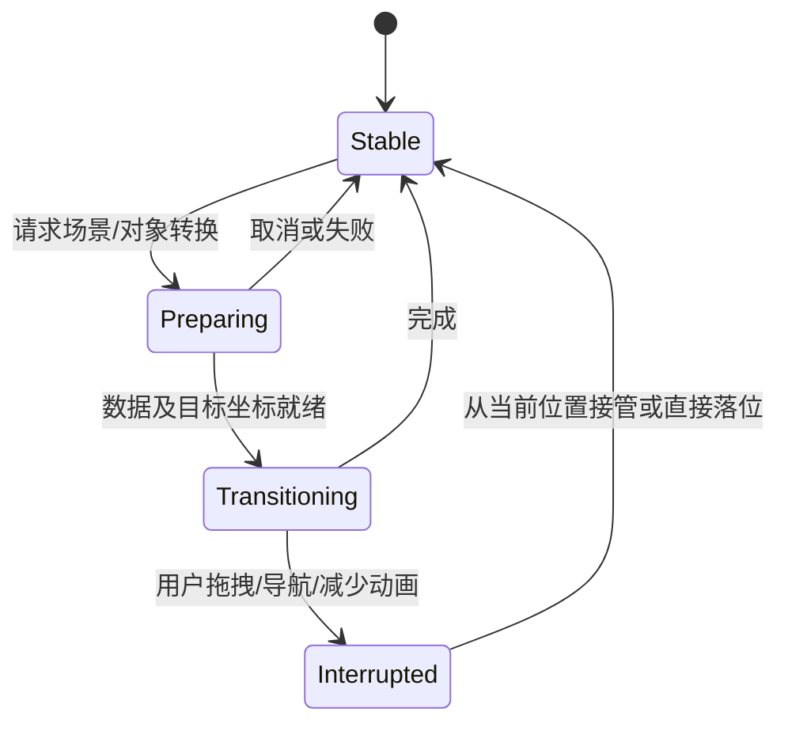
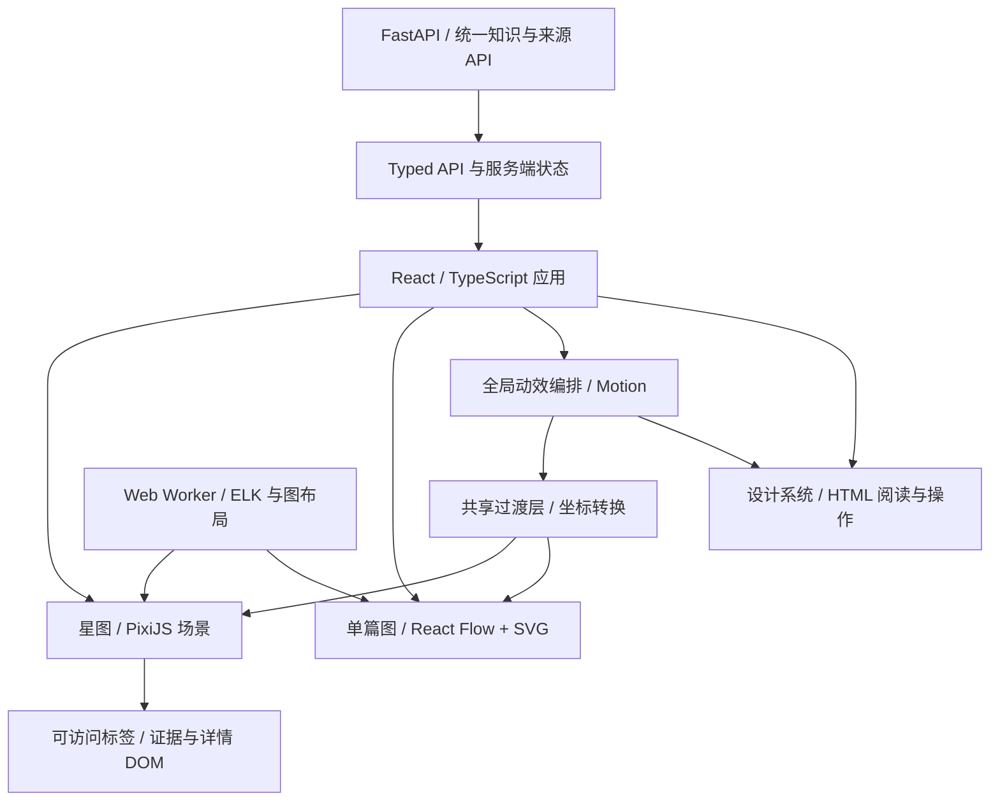

# 前端整体重构：视觉、全局动效与知识星图专项设计

> v2.0 · 2026-09-18 · 方案已获用户认可；阶段 1/2 已完成首轮实现，四条完整分镜和全站迁移仍在推进。
> 配套：[内容质量与整体改进主方案](KNOWLEDGE_EXPERIENCE_REDESIGN.md)。  
> 用户要求：全面重构；全局具备 SVG 式动态效果；星图连同动画表现重新设计；允许整体重构，以技术可行和最终效果为准。

> **2026-09-19 设计补充：** 用户进一步要求减少单调感、增强生机，并重构布局。新增[界面风格与布局第二轮设计](UI_ART_DIRECTION_AND_LAYOUT_V2.md)，提出暖纸/深林主题、场景化布局、知识生长动效与更完整的星图表现。本补充是待验证的设计方向；其视觉与布局选择用于更新本文第 2/4 节的原型，七层结构、四条完整分镜和内容/性能验收标准不变。当前实现的实际状态以[验收报告](REDESIGN_ACCEPTANCE_REVIEW_2026-09-19.md)为准。

## 1. 重构目标、参考案例与最终路线

### 1.1 本次要重建的东西

这次要形成一个完整的动态产品，而不是在原页面上更换颜色、间距和动画类名。

重构范围包含：品牌图形语言、页面内容编排、导航、组件系统、全局图形动效、页面过渡、单篇脉络图、全局星图、问答空间、练习流程、图表、空状态、异常状态、响应式、键盘操作与前端工程。

内容与动画共同设计。例如，用户从问答中的某个概念进入星图时，应该感觉是在追踪同一份知识：概念标记保留身份，视角进入它所属的领域，邻接关系展开，随后显示原文依据。不能只是加载另一页再播放一个淡入。

**验收底线：六大页面都有统一的动态语言，星图具有新的视觉层次与交互表现，并且所有关键场景都能真实操作。增加一层粒子背景、几个 hover 动画或换成另一个默认图组件，均不满足本次要求。**

### 1.2 参考案例：每个参考解决一个具体问题

以下链接在 2026-09-18 查阅。案例页面和作者说明用于分析，不代表已在本项目复现其性能、浏览器支持或全部效果。具体应用方案是本项目的设计判断。

| 参考 | 已查阅的内容 | 本项目借鉴方向 | 使用边界 |
| --- | --- | --- | --- |
| [Linear 官方界面重设计](https://linear.app/now/behind-the-latest-design-refresh) | 一致的导航、标题、视图控制与视觉层级 | 建立稳定的应用外壳、内容优先级、统一细节 | 不照搬其配色或把整个产品做成工单工具 |
| [House of Yellow 作者案例](https://tympanus.net/codrops/2026/09/16/house-of-yellow/) | 品牌、字体、SVG 形态与导航被当作连续的运动系统设计 | 全站图形母题、与内容对应的形态转场，而非各页面独立加动画 | 不照搬持续移动的作品集节奏，学习正文保持可读 |
| [BL/S：文字转为空间结构](https://tympanus.net/codrops/2026/09/09/turning-names-into-digital-architecture-with-three-js/) | 作者解释轮廓点沿曲线路径插值，构成空间线结构 | “信息被组织成结构”的生成过程；轮廓连续性 | 不把正文变成不可读的 3D 字体；无需复制其材质 |
| [Sigma 官方交互示例](https://www.sigmajs.org/demo/index.html) | 已在浏览器查看有搜索、类别、聚类的实际网络图 | 完整的探索工具、局部聚焦与网络分组 | 其默认散点样式不是本项目的最终美术目标 |
| [Cosmograph](https://classic.cosmograph.app/) 与 [cosmos.gl 源码](https://github.com/cosmosgl/graph) | GPU 网络布局/渲染、图形变化与聚类能力的官方说明 | 大规模网络、聚合展开与布局/渲染分离的工程参考 | 商业产品与开源核心区分；不把官方规模宣传直接当项目指标 |
| [Motion SVG](https://motion.dev/docs/react-svg-animation) | 描线、路径形态、SVG 属性动画 | 按语义绘制路径、轮廓与关系；全站统一图形过渡 | SVG 路径需拓扑兼容；复杂 morph 先验证，不假定自动完成 |
| [Motion Layout](https://motion.dev/docs/react-layout-animations) | DOM 布局与共享元素转换 | 列表→详情、概念标记→面板、导航指示的连续性 | WebGL 场景不能直接套 DOM layoutId，需坐标转换层 |
| [React Flow + ELK 示例](https://reactflow.dev/examples/layout/elkjs) | 自动布局与可交互节点集成 | 单篇脉络的层级布局、自定义节点和边 | 图组件是交互基础，仍需自行设计节点与路径；不依赖付费示例 |
| [PixiJS 项目](https://github.com/pixijs/pixijs) 与 [滤镜文档](https://pixijs.com/8.x/guides/components/filters) | GPU 2D 场景、图形、文字、遮罩与效果组合 | 自定义星图外观、领域光场、关系轨迹与镜头 | 滤镜不是无限免费效果，需限定区域与分辨率 |
| [Three.js 交互粒子示例](https://threejs.org/examples/webgl_interactive_points.html) | 官方的空间点交互演示入口 | 若需要真实 3D，用作拾取/空间原型参考 | 只有空间能力确实改善表达时采用，不为技术名词堆引擎 |

此外查阅了 [GSAP Showcase](https://gsap.com/showcase/) 作为创意网站参考入口。它证明存在丰富的商业视效案例，但“被收录”不等于项目开源，也不等于其动效适合知识阅读。实施时只复用许可允许的代码和资产。

### 1.3 推荐路线

**推荐：React + TypeScript + Vite 应用层，Motion 统一 DOM/SVG 动效，React Flow + ELK 承载单篇知识结构，PixiJS 自定义全局星图，布局与图分析放在 Worker。**

这一组合把“可读与可编辑的知识节点”和“具有空间感的全局网络”分别交给合适的表现层。API 和统一知识结构连接二者。不是把多个渲染器同时堆到每一页；每个场景明确拥有自己的渲染资源。

在获准实施后的第一阶段，用同一组中文知识数据验证关键效果。若 PixiJS 的自定义文本/拾取成本导致原型达不到目标，比较 Sigma 自定义 program 或 Three.js 方案；选择依据是视觉还原、交互、数据规模与维护可行性，不是哪个最少改现有代码。

## 2. 全站视觉语言：从页面集合变成同一个知识空间

### 2.1 五个基础图形元素

| 图形元素 | 语义 | 静态表现 | 动态表现 |
| --- | --- | --- | --- |
| 知识点 | 可识别的概念/判断 | 光点、轮廓节点或内容卡，按尺度变化 | 聚焦亮起、展开内容、跨场景保留标记 |
| 联系轨迹 | 两个知识对象之间有依据的关系 | 细线/曲线＋必要标签 | 描线、路径流动、方向提示、证据出现 |
| 领域轮廓 | 一组有主题归属的知识 | 平滑的簇边界与低强度色域 | 收拢/展开，随实际集合变更形态 |
| 来源层 | 材料与可核实证据 | 页片、摘录、证据标记 | 原文片段与节点之间的对应高亮 |
| 焦点框 | 当前关注的对象与范围 | 精细边框、局部亮度、文字标题 | 选中态移动、镜头对焦、详情衔接 |

同一概念的名称、领域色与稳定 ID 在脉络、星图、问答、练习间保持一致。图形可以改变尺寸和形式，但语义身份不能随动画改变。

### 2.2 场景与阅读层

全站分成三种互相衔接的视觉区域：

1. **场景层**：深墨色空间背景，细腻光场、领域轮廓和连接路径，主要用于工作台的网络预览、图谱、星图和生成完成时刻。
2. **阅读层**：高对比、稳定字号、宽度受控的解释和原文；光效不能穿过正文降低对比。
3. **操作层**：浮动工具、命令菜单、筛选、来源抽屉，边界清楚、响应直接；不做大面积强模糊玻璃。

工作台不是满屏装饰星空。首屏的图形区域必须能映射真实知识、最近材料与可点击概念；无数据时显示明确标为示意的图形与上手流程。

### 2.3 拟定视觉 token

| 类别 | 深色主主题 | 浅色阅读主题 | 说明 |
| --- | --- | --- | --- |
| 场景底色 | `#0B1020` / `#111A2C` | `#EEF2F8` / `#F6F8FC` | 依靠少量层次，不堆多色渐变 |
| 阅读表面 | `#172238` | `#FFFFFF` | 长文内容稳定承载面 |
| 主文字 | `#EAF0FF` | `#202B43` | 实测对比度后确定 |
| 次文字 | `#A7B6D0` | `#5E6D84` | 不使用几乎看不见的灰字 |
| 主强调 | `#8FA9FF` | `#4E64DA` | 当前对象与主操作 |
| 关系焦点 | `#6FD6C2` | `#167E6D` | 有依据的当前路径 |
| 待确认状态 | `#E7BC78` | `#8B5E20` | 同时提供状态字样 |
| 正文宽度 | 约 60–75 个拉丁字符的等效宽度 | 同左 | 中文实际行长随面板验收 |
| 字体策略 | 中文系统字体优先，统一 UI 字体栈 | 同左 | 不因外部字体失败造成布局跳变 |

图标采用统一的线性 SVG 与固定描边等级；少量关键图标设计两态，例如“生成→完成”“总览→聚焦”，不让整套图标持续晃动。大标题、正文、图节点、注释各自有严格的字号与字重层级。

### 2.4 组件需要设计完整状态

组件清单至少包括：导航、页标题、材料卡、概念标记、关系标记、来源卡、节点详情、图谱工具条、领域筛选、命令搜索、问答消息、练习卡、反馈面板、统计图、任务状态、空状态、错误状态和确认对话框。

每项定义 default / hover / focus / selected / loading / disabled / error，以及支持的 entering / exiting / expanded / collapsed。移动端触摸状态单独处理，不依赖 hover 触发唯一功能。

组件状态先于动画实现：状态不正确时，动画再精美也不能弥补操作丢失、重复提交或反馈不一致。

## 3. 全局动效：从一次操作到整个应用的连续变化

### 3.1 “全局”具体包括哪些层次

| 层次 | 作用范围 | 具体效果 | 渲染方式 |
| --- | --- | --- | --- |
| 共同图形语言 | 全部主要页面 | 细线描绘、节点展开、连接轨迹、轮廓变换 | SVG + Motion |
| 路由与面板 | 工作台、材料、问答、练习、详情 | 共享对象过渡、版面重排、标题/工具衔接 | DOM + Motion |
| 数据成形 | 材料→知识结构、关系新增、反馈完成 | 片段对应、节点聚合、关系生长 | SVG/DOM 与场景事件 |
| 空间镜头 | 脉络与星图 | 概览→领域→邻域，相机缓动与标签接力 | 场景 camera + SVG/HTML overlay |
| 场景材质 | 图谱/星图/工作台预览 | 低强度光场、局部流动、柔和轮廓 | GPU 图形/着色器 |
| 微交互 | 搜索、按钮、筛选、图标、状态 | 快速反馈、状态形变、焦点移动 | CSS/DOM/SVG |

不是所有区域同一时刻都动。完整模式默认启用完整的场景与过渡；阅读和输入时降低环境动态，关键操作仍有清晰的动态反馈。用户可主动暂停环境效果。

### 3.2 四条必须实现的关键分镜

#### 分镜 A：材料生成一张有主线的图

```text
① 材料已解析
   一张来源卡 + 实际章节/片段 + 学习目标
           ↓
② 后端正在提取
   真实阶段状态；原文中已确认提取的片段被标记
           ↓
③ 结果校验完成
   材料卡收至来源锚点，核心概念轮廓出现
           ↓
④ 结构成形
   主线先落位 → 支撑知识点展开 → 有依据的边逐段生长
           ↓
⑤ 可操作状态
   镜头适应主线；摘要、来源与工具条出现，所有内容可点击
```

- 前两步跟随真实后端事件；没有中间结构时仅显示阶段，不能把假概念当真实输出。
- 结果拿到后，结构成形约 600–900ms，可跳过且不阻塞点击。
- 节点从来源卡“产生”仅表达材料来源，不表示所有节点是同一对象形变。
- 失败时保留材料和目标，状态图形收为可重试提示；不能先播放成功动画再报错。

#### 分镜 B：问答中的概念进入星图

```text
① 答案里的概念标记被选中
   保留名称、颜色、concept_id
           ↓
② 过渡层接管视觉副本
   概念标记沿短弧移动到场景焦点，原页面保持可返回
           ↓
③ 星图已经准备好目标视角
   目标领域出现；相机对焦目标概念
           ↓
④ 邻域与来源展开
   只先亮起一跳关系；同名概念与来源材料清晰可查
```

场景未就绪时先显示明确等待，用户可取消。不能让标记飞向一个尚未加载的位置。返回问答时恢复消息滚动位置和焦点，不重放整段入场。

#### 分镜 C：星图里的领域展开

```text
① 领域总览：低强度轮廓 + 主题锚点 + 聚合连接
           ↓
② 点击领域：相机推进，周围领域退到上下文层
           ↓
③ 领域轮廓舒展，核心节点先出现，支撑节点随后出现
           ↓
④ 聚合连接分解为实际关系；重点标签就位
           ↓
⑤ 局部稳定：拖拽/搜索/选边/看证据
```

领域不随机变成另一幅布局；子节点从预计算位置插值，保留与邻近领域的空间关系。总览和局部不是简单缩放同一堆圆点，而是**信息层级、标签、边与详情的连续切换**。

#### 分镜 D：练习完成回到知识网络

```text
① 用户作答 → 反馈与证据并列呈现
② 用户确认自评 → 服务端写入成功
③ 当前练习概念的外环变化，练习路径标记本次完成
④ 下一题从当前上下文出现，或结束时回到本轮知识网络
```

只更新实际已写入的状态；不能用一次动画把整片领域标为掌握。完成后的反馈内容可继续查看，不被自动跳页吞掉。

### 3.3 跨对象转换的边界

- 同一对象可做共享元素过渡；不同概念不能为了形变顺滑合并成一个。
- “材料片段→概念”是来源对应；“聚合领域→多个概念”是层级展开；这两类动画需与“同一概念换展示方式”区分。
- 知识关系箭头表达真实方向；装饰轨迹不使用相同编码，以免用户误读。
- 动画不能覆盖真实计数、掌握度、生成阶段或置信状态。

## 4. 六大页面的完整重构

### 4.1 工作台：一眼看见自己的知识如何生长

**组成：**上方为简洁标题与主入口；主区域为真实知识网络的局部预览和“继续学习”；辅区为材料、到期练习、未确认关系与最近变化。

**动态表现：**初次进入时网络轮廓逐段显示，最近新增概念短暂亮起；选择某份材料时预览切到相关邻域，内容卡与图景同时更新。点击继续学习后，相关概念标记衔接到单篇脉络的主线。

**不能仅做：**普通统计卡加数字滚动、橙色横幅换为深色横幅、静态背景加随机粒子。

### 4.2 材料与生成：让生成过程可理解

**组成：**来源管理区、材料阅读区、学习目标区、生成状态与结果预览；桌面可并列，手机按阶段展开。

**动态表现：**文件加入时来源卡落位；原文对应信息通过细线与结果预览连接；生成完成采用分镜 A。步骤图标有轻微形变，实际任务失败时转为可恢复状态。

**内容要求：**标题、章节、处理范围、来源版本明确；生成结果先给主问题与主要结论，再展开完整结构。

### 4.3 知识脉络：图形与解释共同讲清主线

**组成：**主问题/结论标题区、主线/关系/大纲/原文切换、可交互画布、详情与证据。

**动态表现：**节点卡有精细轮廓与类型标记；主线边有逐段描绘；聚焦时通过“非相关弱化＋相关关系展开”建立阅读范围。大纲与图切换围绕稳定节点身份进行，不整页白闪。

**布局：**流程/依赖使用有方向的层级布局；概念网络使用稳定局部网络布局；对比材料可以用并列结构。不是所有材料强制横向流程图。

### 4.4 知识星图：独立的探索场景

采用第 5 节完整设计，包含领域、相机、层级、语义关系、标签、桥接概念和路径演绎。窗口不是一个只能拖拽的小圆点容器。

### 4.5 知识问答：有证据的探索空间

**组成：**对话主列、当前检索范围、概念/关系侧区、可展开来源面板。回答中的相关概念可直接定位图谱。

**动态表现：**提问进入时间线；检索时显示实际命中的材料卡；回答按语义块进入，引用标记与侧边证据同步选中；点击关系时局部图从两个概念展开。正文不做每个字母旋转、跳动或长时间打字机效果。

**工程约束：**如果后端只有完成结果，前端不伪装 token 流。真正流式回答需要 API 支持，段落尚未完成时避免不断触发布局动画。

### 4.6 学习与复习：从“表单提交”变成有上下文的理解练习

**组成：**学习目标与上下文、问题场景、回答区、反馈/依据、下一步；题型可用解释、比较、关系重建和情境应用。

**动态表现：**关系题用 SVG 展示可以选择/排列的节点与边；用户解释后反馈区展开并保持答案位置；错误关系以局部注释说明，不用整屏红色闪烁；自评写入后采用分镜 D。

**图表：**复习曲线采用描线和点位出现，横纵轴先稳定显示，动画不改变数值含义；周报根据真实事件高亮新增概念与关系，允许查看发生时间。

## 5. 星图整体重构：新的空间、节点、关系与镜头

### 5.1 目标画面与布局

星图采用“可读的知识星座”作为表现方式：深色空间中有明确的主题群落、精细的光点、少量真实关系光路和可展开标签。领域各有轮廓与锚点；画面焦点始终由用户选择驱动。

```text
┌ 星图 / 全部领域 ── 搜索概念 ── 关系筛选 ── 动效设置 ┐
│                                                     │
│  领域导航        · 领域 A ·        领域 B            │
│  / 面包屑        ╭────────╮      ╭───────╮           │
│                 │ ●──●   │──────│ ●     │           │
│                 │   ╲ ●  │      │  ●─●  │           │
│                 ╰────────╯      ╰───────╯           │
│                                                     │
│                       ● 当前概念                    │
│                      ╱ ╲                            │
│                  ●──●   ●       ┌───────────────┐   │
│                                 │ 当前概念/关系  │   │
│  总览  / 聚焦 / 路径            │ 为什么连接    │   │
│  比例尺与图例                    │ 材料依据      │   │
└─────────────────────────────────┴───────────────┴───┘
```

草图表达区域职责，最终视觉以动态原型为准。主场景占主要空间，工具与阅读抽屉不抢占画面。正文抽屉覆盖范围变化时，相机可调整安全区域，避免选中节点被遮住。

### 5.2 七个画面层次

| 层 | 内容 | 动态方式 | 必须满足 |
| --- | --- | --- | --- |
| L0 背景 | 深色底、稀疏微粒/细网格 | 完整模式下低幅光场变化 | 不能伪装知识节点或影响命中 |
| L1 领域场 | 真实领域簇的低亮度轮廓与色域 | 展开/收拢时平滑变形 | 不遮挡文字，不用夸张球体覆盖全图 |
| L2 聚合连接 | 领域间关系的聚合线路 | 总览显示，局部逐步拆解 | 聚合数量可查看，不能冒充单条因果边 |
| L3 概念体 | 核心/普通/桥接概念，按尺度变化 | 焦点亮度、外环状态、入场聚合 | 大小编码明确，未复习不等于弱智/低质量 |
| L4 关系轨迹 | 实际边、方向、状态 | 聚焦描线、路径流动与端点响应 | 每条实际边可追溯到 ID 与依据 |
| L5 标签 | 领域名、焦点/邻居名称、必要关系标签 | 随缩放接力显隐，位置避让 | 焦点标签始终可读，不能按固定 7 字截断 |
| L6 阅读与操作 | 来源/详情、工具、搜索、图例 | 面板与概念视觉锚点衔接 | HTML 保持键盘与屏幕阅读能力 |

节点位置稳定与背景存在动态是两件事。领域光场可以缓慢变化，知识节点不需要随机游动。

### 5.3 从总览到近景的语义缩放

- **总览**：领域轮廓＋少数核心锚点＋领域之间的聚合连接。大量普通节点以低密度形式提示分布，不铺满全部文字。
- **领域视图**：显示主题、核心与桥接概念，显示当前领域有意义的关系；邻近领域保留位置参照。
- **概念近景**：完整节点名、关系类型、上游/下游、证据入口。当前概念可转为带摘要的内容卡。
- **来源查看**：正文面板展开，当前边或节点保留可见锚点，背景效果减弱。

阈值以屏幕可用空间与标签占用决定，避免用几个固定 zoom 数字适配所有设备。远景与近景之间有过渡带及滞后区，用户滚轮停在临界点时不反复闪烁。

### 5.4 星图交互分镜与时间预算

| 操作 | 动画编排 | 建议时长 | 最终状态 |
| --- | --- | --- | --- |
| 首次进入 | 领域轮廓先出现 → 锚点显现 → 聚合连线描绘 | 500–850ms | 完整总览，可立即跳过 |
| 悬停概念 | 标签/命中轮廓出现，邻近关系轻强调 | 100–160ms | 只预览，不重排 |
| 选择概念 | 镜头短程对焦 → 邻域展开 → 详情接入 | 350–550ms | 焦点、邻域、证据可操作 |
| 进入领域 | 场景推进 → 聚合节点拆解 → 标签接力 | 450–700ms | 稳定局部布局 |
| 搜索定位 | 标记目标 → 相机最短可理解移动 → 邻域出现 | 300–650ms | 精确目标，不再整体适应 |
| 查看路径 | 依次描绘实际路径边 → 端点响应 → 解释卡出现 | 单步 150–220ms，长路径可跳过 | 路径保持静态高亮 |
| 新内容加入 | 局部领域轮廓扩展 → 新节点落位 → 新边绘制 | 450–800ms | 旧布局尽量不动 |
| 返回总览 | 邻域收拢 → 标签退场 → 镜头恢复 | 350–600ms | 原总览和筛选状态恢复 |

长距离镜头移动采取短淡出/重新建立位置，避免强制飞越整张图造成眩晕。动画中用户开始拖拽时，立即交还控制权。

### 5.5 关系表现需要重新设计

- 普通关系使用精细曲线与端点裁切，避免穿过节点文字。
- 选中路径使用更清晰的前景线和少量流动标记；有向边沿真实语义方向运动，对比/相关不制造单向“流”。
- 多重边通过弧度/错位标签区分，近景能查看每个类型；远景合并为可展开的关系束。
- 待确认关系使用断续形态＋状态文字，拒绝边不进入普通探索。
- 桥接概念通过视觉外环或专用标记指出“连接多个领域”；点开说明是哪几条实际关系，不用高亮包装无依据连接。
- 相机路径动画与知识路径动画采用不同编码：镜头移动属于导航，线条流动属于选中的关系。

### 5.6 状态与恢复

星图状态至少包含：loading / overview / domainFocus / conceptFocus / edgeFocus / pathSelecting / pathPlaying / inspecting / empty / error。

每个状态都定义退出方式。筛选、搜索、路径播放、拖拽不能互相抢控制；检查详情后回到先前镜头与选中状态；WebGL context lost 时保留状态并尝试重建，失败则提供可用的二维关系视图和清晰提示。

## 6. 动画系统如何实现，而不是散落在组件里

### 6.1 动效控制器的职责

建立统一 `MotionOrchestrator`，负责场景切换、对象过渡、取消、优先级、动效偏好和生命周期。业务组件提交“发生了什么”，控制器决定应该如何表现；不让每个组件各自设置延迟并猜测任务状态。

拟定事件示例：

```text
material.parsed       材料解析成功，有真实来源信息
knowledge.ready       结构校验通过，节点/边/来源已就绪
scene.entered         场景容器完成测量与资源准备
concept.focused       选中某个稳定 concept_id
relation.selected     选中某条真实 edge_id
path.ready            路径包含实际节点与边 ID
review.persisted      自评及复习记录写入成功
motion.cancelled      用户中断当前过渡
```

每个事件包含任务/场景版本号和对象 ID。旧任务的 ready 事件不能触发当前页面动画；过渡完成回调不能覆盖用户已经进行的新操作。

### 6.2 状态与抢占规则



优先级：用户直接操作 > 最新业务状态 > 场景过渡 > 环境装饰。环境效果永远不能拦截输入。搜索结果多次变化时以最后一次选择为准，前一个镜头任务取消，不排队飞来飞去。

### 6.3 时间、缓动与空间 token

| token | 参考值 | 用途 |
| --- | --- | --- |
| instant | 0–80ms | 开关按下、直接输入反馈 |
| quick | 100–160ms | hover、焦点、标签出现 |
| standard | 180–280ms | 面板、卡片重排、一般状态 |
| scene | 350–650ms | 场景焦点、共享元素、短镜头 |
| formation | 600–900ms | 首次成图或领域展开的完整编排 |
| stagger | 20–35ms / 组 | 只对必要元素分组，不让大列表持续排队 |
| distance-small | 4–8px | 阅读/工具区位移 |
| distance-panel | 12–24px | 面板出现或衔接 |

缓动统一使用少量可预测曲线：交互快速减速，布局采用轻弹性但无明显过冲；镜头用平滑加减速。文字正文不做弹跳。时间参数共享，但不同动作仍有自己的节奏，不能全站只有同一个 fade-in。

### 6.4 SVG 式动态效果的实现边界

- 描线：基于路径长度/偏移控制，方向与实际关系保持一致。
- 轮廓变换：同拓扑 SVG 可以插值；不同拓扑先重采样或交叉衔接，不能承诺任意两形状自动流畅转换。
- 遮罩揭示：用于领域/卡片内容进入，避免遮住焦点控件的可访问名称。
- 共享元素：DOM 层通过同一对象身份连接；SVG 元素直接动画属性。Motion 官方说明 SVG 不走 DOM 布局动画系统，因此需要明确分工。[实现边界](https://motion.dev/docs/react-layout-animations)
- Canvas/WebGL：使用世界坐标与屏幕坐标转换，动画由场景相机/对象属性驱动；不能把 `layoutId` 直接加给一颗 GPU 星体就认为完成。

跨 DOM 与星图的视觉过渡由临时 overlay 代理完成：读取起点 DOMRect、目标屏幕位置和最终大小，代理在顶层表现移动/轮廓变化；真实对象在接管点显现。代理不可点击、不进入阅读顺序，结束/取消时必须释放，焦点落回真实控件。

### 6.5 Motion 与 GSAP 的选择

默认以 Motion 负责 React/DOM/SVG 状态变化，星图场景自行处理相机与 GPU 属性，保持一个明确的动画所有权。

若原型需要复杂的可编排、多轨道时间线或特殊路径变形，再选择 GSAP 管理该独立场景。其时间线可组织一组动画，[官方文档](https://gsap.com/docs/v3/GSAP/gsap.timeline()/)说明了相关能力；是否引入以实际需求和授权条件为准。**同一 DOM transform / SVG 路径 / camera 属性不能同时由两个动画系统写入。**

不为了模仿营销站引入全站强制平滑滚动。知识阅读使用原生滚动；可选的分镜演示有独立播放/暂停，不劫持用户的阅读节奏。

### 6.6 动效模式

| 模式 | 场景效果 | 路由与交互 | 适用情况 |
| --- | --- | --- | --- |
| 完整 | 全部计划中的分层、光场、路径与镜头 | 完整共享元素与 SVG 变形 | 默认，支持的正常设备 |
| 轻量 | 减少非语义背景、光晕与远景细节 | 保留关键结构转换和反馈 | 低性能/低功耗设备或用户偏好 |
| 静态 | 稳定画面，不播放环境和空间变换 | 直接切换状态或极短淡入 | 系统减少动画或主动关闭 |

设置需持久化，切换即时生效。页面隐藏、后台或场景离屏时暂停；恢复时以当前状态出现，不能补播用户离开期间的一串动画。

## 7. 单篇图与星图如何保持一致

同一份结构化知识经过两个展示适配器：

- 单篇图强调“这份材料如何论证”，节点卡可以有更长标签、摘要、顺序与证据。
- 星图强调“全局概念如何连接”，将同一概念的多个材料提及汇聚，展示领域和跨材料路径。
- 展示类型与视觉大小不改变原始关系类型、方向、状态和来源。

### 7.1 共享身份与选择状态

全局使用 `graph_id`、`node_id`、`concept_id`、`edge_id`、`source_id` 区分对象，不能用文字标签作为唯一键。相同标签的不同概念、同一概念的多份材料提及都要能准确定位。

从单篇图进入星图：保留当前材料 ID 和提及 ID，定位对应全局概念，必要时显示“来自这份材料”的来源标记。回到原图：恢复视图、缩放、节点和滚动位置。

### 7.2 坐标与状态分层

```text
知识状态：节点、关系、依据、版本、掌握记录（服务端事实）
视图状态：筛选、选中 ID、打开面板、阅读位置（用户上下文）
布局状态：世界坐标、领域锚点、边控制点、标签布局（可重算）
动画状态：当前进度、速度、旧/新坐标、过渡 ID（临时）
```

业务数据不能被动画引擎直接修改。拖拽布局仅改布局状态；确认关系通过 API 更新知识状态，成功后再体现为持久状态。

## 8. 技术架构、备选方案与可行性

### 8.1 推荐架构与责任分配



这是目标架构。当前已落地 React/TypeScript/Vite 应用壳、Motion 编排入口、PixiJS 星图、FastAPI 构建入口和结构契约；ELK Worker、完整 React Flow 编辑器及全部业务迁移仍按阶段推进。

| 层 | 推荐实现 | 关键约束 |
| --- | --- | --- |
| 前端工程 | React + TypeScript + Vite | 可复现构建，路由分包，类型检查 |
| 设计系统 | CSS token + 可复用组件 + SVG 图标 | 主题/响应式/状态完整，不叠多套旧 CSS |
| 状态 | 服务端缓存、视图 store、场景临时状态分开 | 渲染帧不触发全应用 React 更新 |
| 动效 | Motion + 统一编排器 | 可取消，可复位，属性有唯一所有者 |
| 单篇结构 | React Flow 自定义节点/边 + ELK | 不使用默认节点样式作为最终效果 |
| 全局星图 | PixiJS 自定义 2.5D 场景 | 图算法自行接入，标签/拾取需专门实现 |
| 布局计算 | ELK / 领域约束网络布局在 Worker 执行 | 版本化结果，旧计算不得覆盖新数据 |
| 标签与长文 | DOM/SVG 阅读层 + 按需的场景标签 | 中文、长名称、键盘与辅助技术可用 |
| 接口 | 现有 FastAPI 扩展与版本化结构 | 旧数据兼容，密钥不进入前端 |
| 验证 | 单元/契约/端到端测试＋截图与录屏 | 同时验证正确性、动画与性能 |

React Flow 支持自定义边组件，可作为有标签关系的基础，[官方说明](https://reactflow.dev/learn/customization/custom-edges)；这不意味着自动获得本方案所有视效，节点美术、交互状态和关系语义仍需重建。

### 8.2 为什么推荐 PixiJS 星图

本项目需要高度定制的领域轮廓、层次、局部光场、相机、曲线路径和近景卡片转换，因此推荐把星图视为可控的二维/2.5D 场景。PixiJS 提供绘制基础，本项目承担图布局、领域约束、标签与语义交互。

“2.5D”指通过图层、明暗、有限视差和镜头制造空间感，核心布局仍可读。它不是为了压低成本而削弱 3D，而是为了让关系与中文文字始终可追踪。若真 3D 原型在相同数据和任务下表现更好，可以切换。

### 8.3 候选方案对比

以下是结合项目需求做出的工程判断，不是库官方性能排名。

| 方案 | 优势 | 需要解决的问题 | 结论 |
| --- | --- | --- | --- |
| 继续原生 D3 + SVG | 路径和文本直接可控 | 难以承载预期的全站状态与复杂星图表现；旧实现耦合较多 | 保留算法/导出价值，整体前端不沿旧模块继续补丁 |
| React Flow + ELK 全部图 | 卡片、编辑与布局方便 | 将大星图变成大量 DOM 卡片，空间材质需额外系统 | 推荐单篇图，不包办星图 |
| Sigma + Graphology | 网络探索与 GPU 绘制成熟 | 高度自定义材质与动画需专用 program | 星图可行备选；默认外观不满足交付 |
| cosmos.gl | GPU 图布局与渲染一体化 | 是否适配中文标签、证据层和目标材质需验证 | 大规模场景候选，不仅根据节点数宣传选用 |
| PixiJS 自定义场景 | 视觉层与图形控制自由度高 | 自行完成布局适配、文本层、拾取、可访问性 | 推荐，原型重点验证这些额外职责 |
| Three.js 自定义 3D | 真正空间镜头与立体材质 | 遮挡、标签、拾取、方向含义与眩晕控制更复杂 | 有价值时采用，必须任务测试证明 |

Sigma 官方也说明 WebGL 绘制与高度定制之间存在实现复杂度取舍，[技术说明](https://www.sigmajs.org/)；因此不能因为某个库支持大量节点，就推断它最适合本项目全部效果。

### 8.4 关键难点与预案

| 难点 | 技术做法 | 验证方式 |
| --- | --- | --- |
| 中文长标签 | 测量与换行，按缩放控制层级；焦点标签高优先级；必要时 HTML 覆盖 | 40 字标签、中英混排、缩放和高 DPI |
| 图形拾取 | 空间索引/场景 hit area，视觉大小与可点范围分别控制 | 密集邻居、触摸、缩放后准确选中 |
| 动态领域轮廓 | 基于实际布局计算 hull/平滑边界，更新时有限插值 | 1 节点、离群点、领域变更和多簇 |
| 视图切换稳定性 | 保存领域锚点、锁定已存在布局、插值新节点 | 多次切换与加入材料后空间可预测 |
| 多重边与标签冲突 | 独立控制点、错位标签、局部展开 | 双向边、三种关系、密集核心节点 |
| GPU 与 DOM 同步 | 单一 camera matrix，按需同步屏幕锚点 | 抽屉、缩放、窗口变化时无漂移 |
| 内存与绘制成本 | 图形批处理、局部滤镜、按层销毁、控制像素比 | 反复进出与打开十份材料的资源观察 |
| 原型效果不达标 | 更换渲染适配器，保留语义契约与场景状态 | 同数据和同交互做 A/B 对照 |

性能实现参考 [PixiJS 性能建议](https://pixijs.com/8.x/guides/concepts/performance-tips)。不能用“用了 GPU”代替实测；滤镜区域、文本和绘制批次都会影响结果。

### 8.5 拟定工程目录

以下是目标结构；当前已创建 `frontend/src` 的应用、API、动效、知识脉络和星图基础模块，后续按业务迁移继续拆分目录。

```text
frontend/
  src/
    app/                 路由、应用外壳、错误边界
    api/                 类型、请求、取消、任务事件
    design-system/       tokens、基础组件、SVG 图形
    motion/              编排、过渡层、偏好、场景时序
    features/
      workspace/         工作台
      materials/         材料与生成
      knowledge/         单篇脉络、原文、依据
      galaxy/            全局知识星图
      ask/               问答与会话
      review/            理解练习、反馈、报告
    visualization/
      graph/             节点与边的单篇图适配器
      galaxy/            场景、camera、layers、picking
      labels/            测量、避让、阅读层
      workers/           布局与聚合计算
    state/               选择、过滤、路由恢复
  tests/                 交互、场景与回归测试
  package.json
  lockfile
```

### 8.6 构建与后端连接

开发时运行 Vite 和 FastAPI，通过开发代理访问 API；生产时构建静态资源，由 FastAPI 提供新前端入口与文件。若后端模板保留入口，则使用构建 manifest 解析带 hash 的资源，避免硬编码脚本文件名。官方提供相应的[后端集成方案](https://vite.dev/guide/backend-integration)。

必须验证：深链刷新、API 路径不被 SPA fallback 吞掉、静态资源缓存、离线/网络错误、文件上传、异步任务恢复。Python/模型密钥留在服务端，前端构建不读取 `.env` 中的私密凭据。

### 8.7 许可与依赖管理

只采用可合法复用的库和资产。PixiJS、Sigma、cosmos.gl 的所查项目页标示开源许可，具体接入时记录实际锁定版本及其 LICENSE；不能把产品网站或付费案例库视为开源模板。

当前已将 React、Motion、PixiJS、React Flow 与 ELK 写入前端锁文件；接入时继续记录实际版本和 LICENSE。Motion+/React Flow Pro 等付费示例不作为实现前提。

## 9. 从旧前端迁移到完整新应用

### 9.1 保留、替换与调整

| 处理方式 | 对象 |
| --- | --- |
| 保留事实与业务资产 | 用户材料、节点/概念、来源、复习记录、人工编辑 |
| 重构后接入 | 生成服务、关系证据、问答检索、复习评价、API 契约 |
| 全面替换 | 旧 index.html 主页面、v3/v4 叠加样式、分散 DOM 拼接、图谱/星图渲染与状态 |
| 保留为能力模块 | Mermaid 导出、内容解析、现有可复用图算法、FSRS |
| 仅迁移期保留 | 旧 UI 对照入口，完成迁移后移除默认依赖 |

### 9.2 迁移顺序

1. **关键效果原型**：四条分镜与星图表现先验证，让技术路线服务于目标画面。
2. **知识与视图契约**：确定结构版本、ID、关系、来源、选择和相机状态。
3. **新工程与应用壳**：路由、主题、组件、错误边界、动效偏好和取消流程。
4. **内容到图的完整链路**：真实材料→生成→证据→单篇图→星图；不能只接展示 mock。
5. **其余页面迁移**：材料、问答、理解练习、记忆/报告、输入源和设置，逐项对照功能清单。
6. **全站一致性检查**：没有遗漏成旧样式的弹窗、空状态和辅助功能。
7. **构建与默认入口切换**：新 UI 成为默认；旧资源退役，但不删除用户数据。

阶段产物用来检验方案，不自动把未完成的高品质效果挪出范围。遇到技术障碍时给出具体原型证据和替代路线，不能只说“改动较大，所以先简化”。

### 9.3 后端需要跟进的接口能力

- 图结构返回摘要、重要程度、节点与真实关系 ID、来源与版本。
- 星图支持领域汇总与局部邻域获取；数据规模较大时分页/按范围请求，而非永远全库一次返回。
- 路径返回实际边及依据，解释生成使用这些数据。
- 任务返回稳定的阶段/状态/结果版本；若实现增量节点事件，需要明确草稿与校验完成状态。
- 问答返回结构化来源与会话信息；可选增量回答必须有取消和完成语义。
- 复习将语义反馈与正式写入自评分开，确认响应提供真实更新的对象。

前端不能因为接口暂缺就用随机节点、随机百分比或硬编码关系填充真实页面。视觉开发可使用明确标示的测试数据，联调验收必须换成真实端到端数据。

## 10. 验收：视觉、动画、内容与性能同时达标

### 10.1 交付材料

- 六大页面的桌面/手机、深/浅主题截图。
- 四条关键分镜的实际交互录屏，每条约 15–40 秒，包含操作和最终可用状态。
- 星图在 500、2,000、10,000 节点档位的布局/标签/搜索演示；规模与边数标注清楚。
- 完整/轻量/静态三档动效对照，包含中途切换。
- 内容生成、证据引用、问答和复习的固定评测结果，沿用主方案要求。
- 构建、启动、测试、数据兼容和 Git 同步说明。

静态截图只证明某一帧的外观，不能证明动画顺畅、可中断或跨场景连续，因此不能取代录屏和实际操作。

### 10.2 视觉与动画通过标准

| 项目 | 通过条件 | 不通过示例 |
| --- | --- | --- |
| 全站重构 | 页面、组件、状态、主题和辅助入口一致 | 首页新皮肤，其余弹窗还是旧布局 |
| 全局动态身份 | 六大页面共享图形语言，至少四条分镜真实连通 | 每页只有同样的淡入或按钮缩放 |
| 星图美术 | 领域、概念、关系、文字、焦点层次明确 | 一堆圆点加霓虹发光 |
| 星图动画 | 总览/领域/邻域的结构和标签连续接力 | 重新随机排布后镜头猛跳 |
| 语义一致 | 关系方向、来源、概念身份不会因效果而改变 | 流光方向与依赖箭头相反 |
| 交互控制 | 任意镜头/转场能被新操作接管 | 动画结束前不能点击或拖拽 |
| 中文可读性 | 焦点和重要标签完整、无明显互遮 | 只保留前几个汉字、文字压在光晕上 |
| 内容真实性 | 实际数据与任务状态驱动效果 | 请求失败仍显示生成成功 |
| 兼容性 | 手机、键盘、减少动画都能完成任务 | 只有鼠标悬停才能看证据 |

### 10.3 性能基准

| 场景 | 数据规模（节点/边） | 拟定目标 |
| --- | --- | --- |
| 单篇图 | 100 / 150 | 数据就绪后约 1 秒内可操作；常规交互帧时间 P95 目标 ≤ 20ms |
| 常规星图 | 500 / 800 | 完整模式下缩放、选择和短镜头接近 60fps；记录 P95 帧时间 |
| 中规模星图 | 2,000 / 5,000 | 领域聚合与标签分级下仍流畅；目标 30fps 以上，重点动作尽量接近 60fps |
| 大规模星图 | 10,000 / 30,000 | 通过聚合/按需展开可用，检索与定位完整；首轮原型确定可见预算 |
| 重复使用 | 连续打开/关闭 10 次图谱并切换页面 | 无线性增长的残留 worker、监听器或 GPU 资源 |
| 静态/后台 | 无操作、效果暂停或页面隐藏 | 不持续运行布局，渲染循环按状态停止 |

这些是候选验收预算，尚未测量。记录 CPU/GPU、浏览器、分辨率、设备像素比、数据密度和效果档位；不能把高配机器上的单次结果推广到所有设备。

优先优化批处理、图层、像素比、过滤范围、标签策略和增量更新。低端设备可以降级，正常设备完整模式必须实现约定效果，不能以通用兼容性为理由统一退回简陋圆点图。

### 10.4 必测的中断与边界条件

- 动画到一半切换页面、搜索新概念、修改筛选、打开详情、拖拽节点。
- 在领域切换临界缩放位置持续轻微滚轮，不闪烁、不重复创建对象。
- 图为空、只有一个概念、所有节点孤立、超长标签、同名异义、多重边、关系环。
- WebGL 不可用/context lost；重新创建场景后选择与布局可恢复。
- 生成超时/重试、问答取消/追问、复习重复提交、服务端更新失败。
- 浅/暗主题切换不重新请求模型，不全图重排，不导致文字消失。
- 操作完成后的焦点正确，Esc、返回按钮和浏览器后退可预测。

## 11. 完成定义与本轮边界

这次重构完成时，用户能看见一个视觉、交互、动画与知识语义统一的新应用：材料能形成主线，概念能在页面与星图间连续定位，星图具有完整的空间表现，问答和练习都围绕有依据的关系展开。

**不接受的完成方式：**只修改布局；只替换主题色；仅增加背景 SVG；把 D3 小圆改为更亮的小圆；只录一段无法操作的演示；为了快而把核心动效标为“后续可做”。

**允许的技术取舍：**依据原型更换渲染器；在低性能设备使用轻量模式；以可读的 2.5D 替代没有学习价值的自由 3D；对大规模数据做语义聚合。每项取舍都应保留约定的体验目的，并说明验证依据。

当前已交付阶段 1/2 的可运行实现：新前端壳、六个场景、全局动效入口、单篇 SVG 图、Pixi 星图、理解练习接入和结构契约。本文列出的四条完整分镜录屏、全站业务迁移、固定材料评测和大规模性能记录仍是后续实施产物；完成后再同步最终实现代码到 Git。
