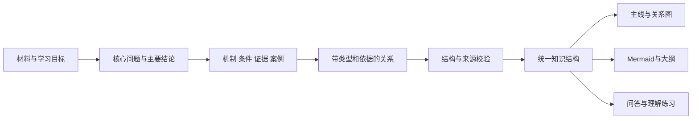
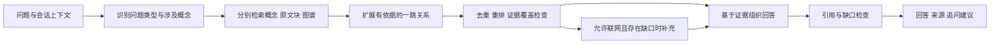

# 知识脉络智能体：内容质量、前端整体重构与全局动效方案

> 状态：用户已确认方案可行；阶段 1/2 已开始并完成首轮可运行实现，后续阶段仍在推进。
> 版本：v2.0 · 2026-09-18，按用户最新要求扩大为前端整体重构。  
> 当前实现记录见 [实施记录](IMPLEMENTATION_PROGRESS.md)。本轮已建立新前端、结构契约和首轮业务场景，未批量迁移或重生成现有知识库。

## 本版调整与阅读入口

本版取代 v1 的“保留现有前端、优先局部改造”策略。用户已经明确：**界面要全面重构，全局具有 SVG 式的动态表现；星图的视觉、交互和动画表达都要重新设计；只要技术可行，可以整体重构，不为降低改动成本牺牲效果。**

- 本文保留内容生成、知识联系、问答与复习的详细诊断和改进要求。
- [前端视觉与全局动效专项设计](FRONTEND_VISUAL_MOTION_SPEC.md)给出视觉案例、逐页动态分镜、星图场景、技术选型、迁移路径和动效验收。
- “全面重构”包括信息架构、页面组成、设计系统、组件、状态管理、渲染、动效、响应式与测试；不能以新增 CSS 覆盖文件作为最终交付。
- “全局动效”是同一套图形与转场语言贯穿全部主要页面，数据对象可以在页面与场景间连续转换；它不仅是全屏背景动画，也不仅是按钮 hover。
- 遵守“先文档、后审阅、再实施”：方案已获用户认可，当前按阶段推进实现；批量数据改写仍需单独确认范围。

建议审阅顺序：专项设计第 1–5 节看最终视觉与星图体验 → 第 6–9 节看全局动效与可行性 → 本文第 5、9、10 节看内容和问答质量 → 本文第 13–14 节看验收与实施。

## 1. 本次改进要达到什么效果

项目需要从“把材料画成图、把知识改成题”，升级为“帮助用户理解核心问题、解释知识之间的关系，再验证是否能够运用”。界面更新、动画设计和生成策略需要围绕同一个目标推进。

预期使用体验：

1. 导入一份材料，先看到它主要回答什么问题、最重要的结论是什么。
2. 在图上沿着“前提 → 机制 → 结论 → 应用”阅读，能区分包含、依赖、因果和对比。
3. 点击一条关系，立即知道为什么连接、证据在哪、是否只是待确认的推断。
4. 打开星图，先理解有哪些知识领域，再探索某个领域或跨领域路径，而不是面对满屏线条。
5. 提问时获得有结论、有推理、有来源的回答；练习时解释机制、分析案例、辨析错误和迁移应用。
6. 整个应用具有统一、鲜明的动态视觉身份：轮廓描绘、路径生长、节点聚合、共享元素转换与镜头推进贯穿各页面，同时保持知识文字清晰可读。

**内容正确与关系可信、完整的产品体验、现代视觉与全局动效都是交付条件。视觉不是最后加上的装饰；实现成本不能作为保留粗糙体验的理由。技术选择必须通过原型和性能验证，信息表达必须尊重事实与来源。**

### 1.1 本文审查范围与限制

已静态阅读生成、长文本、关系对齐、知识问答、复习、星图、图谱、页面模板与 CSS 等实现，并查看仓库中的既有首页和星图截图。截图是仓库归档资料，不代表当前运行中的实时页面。

下面标注“已确认”的问题有代码依据；涉及现有知识库中错误比例、真实模型输出命中率、性能帧率的判断，需要后续取样和实测。本文中的数量、性能、质量阈值均为**拟定验收目标**，不是已经达到的结果。

### 1.2 实施边界与重构原则

- 采用新的组件化前端工程，推荐 React + TypeScript + Vite；替换旧页面模板、分散的 DOM 拼接、CSS 叠加与图谱渲染模块。
- 重建全站设计 token、布局组件、业务组件、数据状态和动画编排。旧前端只作为迁移期功能对照，不作为效果上限。
- 单篇脉络采用可读的 DOM/SVG 图形系统；全局星图采用可定制的 GPU 场景。布局算法、知识数据和渲染器解耦。
- 当前推荐后端保留 FastAPI 与 SQLite，但关系/证据结构和 API 可调整；如果现有接口阻碍正确表达，重构接口而不是在前端掩盖问题。
- 支持 2.5D 空间感、相机转场、图形形态过渡和适量程序化材质。是否引入真正 3D 由标签可读性、交互与性能原型决定，不能简单以“成本高”为由排除。
- 现有材料、图谱、复习记录、人工编辑保持可追溯；重构页面不等于重置知识库。
- 文档审阅后才实施；阶段划分用于控制技术风险，并不缩减已约定的完整效果。

## 2. 当前问题诊断：症状、根因与影响

### 2.1 已确认的内容与关联问题

| 编号 | 代码依据 | 当前行为 | 对用户的影响 | 优先级 |
| --- | --- | --- | --- | --- |
| C01 | `app/prompts/graph_gen.py`，`GRAPH_GEN_PROMPT` | 固定要求 8–16 个节点、标签 12 字以内；优先主题与子主题 | 容易凑节点、过度压缩关键判断，把目录当要点 | P0 |
| C02 | `app/services/longtext.py`，`map_reduce()` | 抽取 `relations`，构造 `node_payloads` 时却清空 `parent_id` 和 `related_nodes`，也没有把类型与证据写入节点结构 | 长文的文字图与交互节点结构不一致，关系在保存环节丢失 | P0 |
| C03 | `app/services/longtext.py`，`_fallback_extract()` | 降级时把相邻标题/条目串成 `related` | 排列顺序被误当知识联系 | P0 |
| C04 | `app/services/graph_generation.py`，`save_generated_graph()` | 节点保存只有父节点及关联 ID，缺少本次生成的关系类型、方向、证据的完整统一传递 | 前端知道“连了”，却不知道“为什么连” | P0 |
| C05 | `app/services/graph_management.py`，`auto_link()` | 以字符集合重合率 ≥ 0.5 自动跨图关联 | 字面相近的不同概念可能被误连，且返回前 20 条不等于限制实际创建 20 条 | P0 |
| C06 | `app/services/knowledge_path.py` | 最短路径按无向连接搜索；查询未显式排除 rejected；解释仅接收概念名序列 | “可连通”可能被解释成“因果链/学习先后”，路径叙述缺少证据约束 | P0 |
| C07 | `app/services/mermaid.py`，`validate_mermaid()` | 主要检查声明和能否解析节点 | 能解析不代表边合理、重点覆盖、图与数据一致 | P1 |
| C08 | `app/services/graph_generation.py`，标题生成 | 优先源名称，否则截取正文前 50 字 | 列表标题可能成为一段原文，主题难扫读 | P1 |

说明：项目已有概念消歧、关系 evidence/status、分块与向量检索，不需要全部重写；问题主要是不同路径没有共同遵守一份结构与质量约束。

### 2.2 已确认的视觉与交互问题

| 编号 | 代码依据 | 当前行为 | 改进方向 |
| --- | --- | --- | --- |
| U01 | `templates/index.html`、`css/v3.css`、`css/v4.css` | 大面积橙色横幅、多个彩色统计卡、相似权重的白卡 | 建立统一层级，主内容优先，减少无信息的装饰 |
| U02 | `forceGraph.js` | 文本置于小圆内，超过 6 字截断；全部关系变成普通线条 | 节点卡片、标签换行、关系名称与箭头 |
| U03 | `forceGraph.js` | 对边用排序后的端点去重 | 不同方向/不同类型的关系可能合并，必须按语义去重 |
| U04 | `galaxyPanel.js` | 节点随机从中心附近展开；领域圆跟随均值位置，没有明确的领域聚合定位力 | 稳定布局、领域簇、层级缩放、避免重进页面全图重排 |
| U05 | `galaxyPanel.js` | 概念只显示前 7 字；邻居高亮后缺少完整复位流程 | 完整名称、搜索定位、清除聚焦、返回总览 |
| U06 | `canvasPanel.js` | 缩放按钮主要操作 Mermaid 容器 | 各视图共享缩放/适应/全屏控制，状态与实际视图一致 |
| U07 | `canvasPanel.js` | 全屏查找 `.canvas-panel`，实际模板使用 `.canvas-card` | 修复元素定位并做真实浏览器验收 |
| U08 | `forceGraph.js` | 重新渲染前没有统一销毁上一 simulation；D3 可直接修改传入节点 | 明确生命周期、克隆数据、隐藏时停止计算、释放观察器 |
| U09 | `app.js` | 打开图时可能先渲染后切换可见页面 | 避免按隐藏容器的兜底尺寸布局；使用尺寸观察和可见后适应 |
| U10 | 归档星图截图 | 小字、边交叉、部分标签含 `<br` 一类残片 | 需抽样确认旧数据清洗范围；不只在视觉层遮盖解析错误 |

### 2.3 问答与复习：必须分开改

项目里的“知识问答”与“复习出题”是两个不同流程。用户感到“像填空”，既可能来自练习形式，也可能来自答案模板化；本方案覆盖两者。

| 编号 | 代码依据 | 当前行为 | 改进方向 |
| --- | --- | --- | --- |
| Q01 | `graph_management.py`，`generate_quiz()` | 自动题基本都是“什么是 X？” | 按节点内容与关系生成解释、辨析、应用题 |
| Q02 | `review.py`，`_graph_recall_items()` | 随机遮住约 30% 节点，让用户补名称 | 保留为可选记忆模式；主推重建关系和解释主线 |
| Q03 | `review.py`，`_grade()` | 以正则得到的字符串集合重合率评价自由回答 | 中文句子常不能这样分词；改语义反馈，不把词面百分比当理解程度 |
| Q04 | `review.py` | 部分模式不带复习记录 ID；没有明确的完成幂等设计 | 题目反馈、自评、FSRS 更新分步，重复提交不重复更新 |
| Q05 | `review.py` | 题型无题时降级闪卡，但 session.mode 未同步 | 实际模式、页面文案与后端一致 |
| Q06 | `knowledge.py`，`knowledge_query()` | 去疑问词后把剩余内容拼为单串 | 多概念比较题可能检索成一个不存在的长词 |
| Q07 | `knowledge.py` | 以拼接内容字符数衡量覆盖，300 字作为联网兜底门槛 | 改为问题分解与证据覆盖，不把字数当相关性 |
| Q08 | `knowledge.py`、`askPanel.js` | 主要是平铺片段与来源标签，来源定位能力不足 | 回答内证据编号、来源卡、回原图/原文定位 |
| Q09 | `AskRequest`、问答路由、`askPanel.js` | 问答请求未传递前端联网开关；预留 thread_id 未形成清晰多轮问答能力 | 开关真正影响请求；显式管理上下文与清空会话 |
| Q10 | `knowledge.py`，`_web_retrieval()` | 抓取页面被标成“官方正文”，但未验证官方身份 | 使用中性“网页正文”，显示域名和真实来源 |

## 3. 建议的信息架构

主导航调整为六个明确入口：

| 入口 | 主要任务 | 主操作 | 次操作 |
| --- | --- | --- | --- |
| 工作台 | 知道今天做什么、继续上次学习 | 继续学习 / 导入材料 | 查看薄弱知识、最近脉络 |
| 材料与生成 | 导入、检查材料、设定学习目标 | 生成知识脉络 | 查看原文、调整范围 |
| 知识脉络 | 读懂一份材料的知识结构 | 沿主线探索 | 查关系、看证据、练习 |
| 知识星图 | 看全局、找连接、定位缺口 | 搜索概念 / 聚焦领域 | 路径探索、待确认关系 |
| 知识问答 | 带着问题检索与深入理解 | 提问 / 追问 | 跳转来源、加入练习 |
| 学习与复习 | 验证理解和安排复习 | 开始理解练习 | 闪卡、周报、历史记录 |

“导出、视频字幕、Obsidian、长期记忆、设置”放入对应页面或辅助入口。知识问答从“我的”中提升为独立入口，避免主功能藏在杂项里。

### 3.1 工作台

- 顶部用短标题与一句说明建立定位，不再让大进度条占据首屏主要注意力。
- 第一张卡展示“继续上次脉络”：主题、核心问题、上次停留节点、继续按钮。
- 第二组展示“建议下一步”：到期复习、待确认联系、尚未理解的关键节点；所有数字来自真实数据。
- 最近脉络展示主题标题、1 句摘要、主要领域、最近操作时间。长标题两行显示，完整标题可查看。
- 统计只保留辅助作用。不能用节点越多、连线越多等同于学习越好。
- 空知识库显示三步上手流程与“导入第一份材料”，不显示假数据或假掌握率。

### 3.2 材料与生成

输入区分为“材料内容”和“学习目标”，避免只有大文本框：

- 材料：文本、文件、链接、字幕、Vault；解析后显示标题、字数、章节、来源状态。
- 学习目标：默认“理解主线”，可选“分析原理”“比较方案”“掌握流程”“准备复习”；用户可补一句自己的问题。
- 范围：短材料整体生成，长材料可选章节；默认不静默截断超限材料。
- 深度：概览 / 标准 / 深入。改变展开层次和支持材料密度，不通过强制凑节点控制复杂度。
- 来源：仅使用材料 / 允许联网补充；外部补充与材料事实分开标记。

生成时显示真实任务状态：解析材料 → 提取重点 → 整理关系 → 检查依据 → 构建脉络。后端没有精确进度时使用阶段状态，不伪造百分比，也不把内部推理过程作为内容展示。

生成结果先给出“主问题＋核心结论＋3–5 个重点＋材料边界”，再进入图。用户应能立即判断是否抓住了要点。

## 4. 视觉设计规范

### 4.1 推荐方向：有连续动态视觉的知识空间

推荐以“深墨色空间舞台＋清晰阅读层”为主要视觉方向：工作台、脉络、星图和问答共享光点、连接轨迹、轮廓与聚合展开的视觉语言；阅读正文使用稳定的高对比内容层。提供同等完整的浅色主题，而非只给深色背景反色。

具体色彩、字体、图标、材质、场景结构与状态设计以[专项设计第 2 节](FRONTEND_VISUAL_MOTION_SPEC.md)为准。以下 token 是阅读层基础参考值，不代表全局场景只能由普通白卡组成。

| 元素 | 拟定规范 | 目的 |
| --- | --- | --- |
| 页面背景 | 浅灰蓝 `#F3F5F9`，暗色 `#101625` | 降低大面积渐变干扰 |
| 内容卡片 | 浅色 `#FFFFFF`，暗色 `#192235` | 建立阅读面 |
| 主文字 | 浅色 `#202B43`，暗色 `#E2E8F6` | 提高可读性 |
| 辅助文字 | 浅色 `#64718A`，暗色 `#A4B2CC` | 信息分层，避免过浅灰字 |
| 主交互色 | 靛蓝 `#6378E8`，暗色使用更亮的匹配色 | 标示选择、操作和聚焦 |
| 领域/类型色 | 青绿、蓝、紫、琥珀等少量稳定色 | 用于分类，不随页面重绘变化 |
| 圆角 | 输入/按钮 8–10px，卡片 14–18px | 统一语言，减少过度胶囊化 |
| 间距 | 4/8/12/16/24/32px | 形成稳定节奏 |
| 字号 | 正文 14–16px，页标题 26–32px，图节点约 13–15px | 先保证正文与节点读得清 |
| 阴影 | 轻阴影仅用于悬浮面板/拖拽节点 | 不让所有卡片都浮起来 |
| 图标 | 同一套线性 SVG 图标 | 替换不同字体下形态不一致的符号 |

颜色只是设计起点；实施时需要实测文本与背景对比度，不把这些色号视为已通过可访问性验收。

### 4.2 页面结构草图

```text
┌ 品牌 / 当前工作区 ───────────────────── 搜索  主题  设置 ┐
│                                                       │
│ 工作台      知识脉络 / 当前材料                         │
│ 材料与生成  核心问题：这份材料要解释什么？               │
│ 知识脉络    核心结论：一句完整判断。                     │
│ 知识星图                                              │
│ 知识问答    [主线] [关系图] [大纲] [原文]    搜索/适应   │
│ 学习复习    ┌──────────────────────┐ ┌──────────────┐ │
│             │                      │ │ 当前节点     │ │
│             │   可探索知识画布     │ │ 核心解释     │ │
│             │                      │ │ 关系及证据   │ │
│             │                      │ │ 来源 / 练习  │ │
│             └──────────────────────┘ └──────────────┘ │
└────────────────────────────── 当前状态 / 保存状态 ─────┘
```

桌面端右侧详情宽度约 300–360px，可折叠；大屏限制正文行宽，不把段落拉到整屏。平板改为可收起侧栏与详情抽屉；手机使用底部导航，详情为底部抽屉，图谱工具放入紧凑工具条。

## 5. 知识脉络的内容生成：先结构，再表现

### 5.1 提取顺序

建议明确采用以下语义流程，避免直接让模型生成几种互不一致的格式：



具体规则：

1. 先输出主问题和核心回答，再选知识点。主题名称不等于主要结论。
2. 区分核心、支撑、扩展三个重要程度；重要性影响初始展示，不用连接数量替代内容重要性。
3. 每个知识点包含完整的关键判断、解释、成立条件与证据；缺少某项时标记缺失，不补造。
4. 短材料可以只有 3–5 个节点；标准材料优先呈现约 5–18 个核心与支撑节点；长文保留章节与展开层次。数量是展示预算，不是生成硬指标。
5. 相邻条目不自动产生语义关系；层级节点的父子关系只表示包含。
6. 只给材料支持的关系命名。模型推断与原文明确陈述应区分。
7. 拒绝“概述、相关内容、其他、总结”这类没有具体信息的占位节点。
8. 标题由主要主题与核心问题生成，保留原始文件名为来源信息；不直接截正文当标题。

### 5.2 关系语义与方向约定

| 类型 | 含义 | 方向约定 | 显示方式 |
| --- | --- | --- | --- |
| contains / 包含 | 分类、组成或层级 | 上层 → 下层 | 中性实线＋包含标签 |
| depends / 依赖 | A 成立或执行需要 B | A → B，读作“A 依赖 B” | 箭头＋依赖标签；不直接当学习顺序 |
| cause / 导致 | 有依据的因果 | 原因 → 结果 | 箭头＋导致标签 |
| contrast / 对比 | 维度上的差异 | 对称关系，存储时统一端点顺序 | 双端/无方向对比线＋比较维度 |
| extends / 扩展 | B 扩展 A | A → B | 箭头＋扩展标签 |
| example / 例证 | B 是 A 的例子 | A → B | 例证标签 |
| related / 相关 | 有依据但不能进一步定性的关联 | 对称 | 较弱线条，明确不是因果 |

“同一概念”属于跨材料的身份对齐；它与因果、对比等知识关系分开处理，不让“同名/同义”占满关系图。

**需要避免的歧义：**“A 依赖 B”在存储上指向 B，但学习顺序通常先学 B 再学 A。因此关系图与学习路径不能机械共用箭头方向。

### 5.3 统一结构示例

以下为**拟定接口契约示例**，不是当前已有接口；例子只演示数据形状，实施时证据必须来自实际上传材料。

```json
{
  "schema_version": 2,
  "title": "模型复杂度与泛化表现",
  "focus_question": "为什么训练表现提升不一定带来泛化提升？",
  "summary": "需要结合训练与验证表现判断模型是否学到可泛化的规律。",
  "nodes": [
    {
      "id": "n1",
      "label": "过度拟合训练样本",
      "node_type": "conclusion",
      "importance": "core",
      "explanation": "此处应为材料支持的具体解释。",
      "conditions": [],
      "evidence_refs": ["s1"]
    },
    {
      "id": "n2",
      "label": "验证表现下降",
      "node_type": "conclusion",
      "importance": "core",
      "explanation": "此处应为材料支持的结果解释。",
      "conditions": [],
      "evidence_refs": ["s1"]
    }
  ],
  "edges": [
    {
      "id": "e1",
      "source": "n1",
      "target": "n2",
      "relation_type": "cause",
      "explanation": "此处应说明材料中建立这条因果关系的理由。",
      "evidence_refs": ["s1"],
      "basis": "explicit",
      "status": "pending"
    }
  ],
  "sources": [
    {
      "id": "s1",
      "chunk_id": "chunk-example",
      "quote": "实际实现必须使用可回查的原文片段",
      "char_start": 0,
      "char_end": 20
    }
  ],
  "learning_route": ["n1", "n2"],
  "gaps": ["材料尚未覆盖的限制或问题"]
}
```

证据的坐标基于保留的解析后原文版本；无法从 PDF 稳定取得页码时只显示实际可验证的章节/块位置，不能制造页码。`basis=explicit` 不等于 `status=confirmed`：有原文依据与人工确认是不同维度。

### 5.4 质量检查与修复

生成后分两类校验：

- **确定性检查**：JSON schema、唯一 ID、合法类型、边端点存在、父子无环、重复边、跨图 ID 重映射、证据坐标与片段匹配、各视图节点一致。
- **语义检查**：是否覆盖主问题、结论是否有依据、是否把相关写成因果、重要条件是否遗漏、是否出现重复/空泛节点。

结构错误可以规则修复；语义问题用一次受约束的修复调用，并只针对发现的问题重新生成。修复仍失败则显示具体缺口，不能标成“已验证通过”。校验结果是检查报告，不使用未经校准的“可信度 98%”。

### 5.5 长材料与章节

- Map 阶段输出带 `chunk_id` 的要点与关系，保留原始提及和证据。
- 合并时处理别名、同名异义与冲突陈述，不能仅凭名称合并。
- Reduce 阶段选择核心主线，依据关系和重要性建立章节概览；细节保留在子图。
- 存储层保留关系类型、方向、证据；章节子图也必须使用统一保存流程。
- 无模型降级只展示章节、标题和可确定的层级；不得把标题邻接编成知识链。
- 超长输入按章节/块处理，说明实际处理范围及尚未处理部分。
- 章节排序仅显示“阅读顺序”，不能伪装成章节之间的因果关系。

## 6. 单篇脉络图：让主线、关系与证据同时可读

### 6.1 四种视图的定位

| 视图 | 用途 | 默认内容 | 布局 |
| --- | --- | --- | --- |
| 主线视图 | 第一次读懂材料 | 核心问题、关键机制、主要结论与关键条件 | 有层次的横向/纵向路径 |
| 关系图 | 探索分支、交叉联系 | 当前主线及一跳邻居 | 稳定布局，可展开局部 |
| 大纲 | 顺序阅读和导出 | 结论、解释、依据、子知识点 | 可折叠文本树 |
| 原文 | 核实来源 | 选中节点/关系的证据与上下文 | 原文面板，定位高亮 |

Mermaid 保留为“图形预览/导出”能力，不与上述核心使用目的混淆。流程材料可以用层级/流程布局，普通知识网络可以用力导向布局，不强制所有数据表现成一种图。

### 6.2 节点设计

- 用矩形或圆角卡片展示单篇知识点，首屏可读完整的关键标签。
- 第一行是类型与重要程度，主体是名称/判断；详情只在聚焦后展开，避免每张卡同时放长文。
- 超长标签换行并允许查看完整名称，不再按 6 个字硬截断。
- 节点颜色表达类型；选中描边表达交互状态；掌握度以独立小标示表达。三个维度不混用同一种颜色规则。
- 摘要与证据在固定详情面板显示，不用 5 秒后消失的气泡承载重要内容。

### 6.3 边与聚焦交互

- 边有类型、方向、标签；选中后显示一句解释和证据。
- 同端点不同类型的关系保留；反向因果/依赖不被无向去重吞掉。
- 双向边或多重关系用轻微弧线/错位标签区分，不重叠成一根线。
- 单击节点：高亮自身与一跳邻居，其他节点弱化；右侧列出上游、下游、对比、例证。
- 单击边：显示“A —关系→ B”、为什么成立、条件、原文出处。
- 单击空白 / Escape：取消聚焦；“总览”：恢复显示并适应画布；保留用户折叠状态。
- 关系标签在局部视图中显示，远距离总览只显示重要连线，避免全屏文字交叉。
- 选中节点可直接“围绕它提问”“练习这一关系”“跳到原文”“查看全局概念”。

### 6.4 缩放、布局与性能

- 缩放、适应、全屏按钮作用于当前视图，比例指示与实际缩放一致。
- D3 使用数据副本，避免污染业务对象；每次销毁释放 simulation、监听器与 ResizeObserver。
- 初始预计算稳定位置后入场；只在拖拽或拓扑改变时短暂恢复布局计算。
- 改主题只改样式；改一个节点尽可能局部更新；重进页面保留布局与视角。
- 开页后再测量可见容器，窗口/抽屉变化后重新适应，不依赖硬编码宽高。
- 手机详情抽屉打开时仍能关闭/返回；缩放和拖拽不能吞掉整页滚动。

## 7. 知识星图：从全局地图到可解释的局部关系

### 7.1 三层探索，而不是一次铺满

| 层级 | 用户看到什么 | 操作后发生什么 |
| --- | --- | --- |
| 全局总览 | 领域簇、核心概念、领域间的主要连接 | 点击领域进入局部 |
| 领域局部 | 本领域概念、子主题、少量跨领域桥接节点 | 点击概念聚焦一跳邻居 |
| 概念邻域 | 上下游、对比、应用、来源与掌握情况 | 点击关系看证据，或选择起终点 |

星图作为独立的核心场景整体重建：领域形态、节点材质、镜头、标签层级、关系轨迹和选中详情统一设计。第一版完整交付全局→领域→邻域的连续层级切换，不以普通力导向图换色作为完成标准；具体分镜与技术路线见专项设计第 5、8 节。

### 7.2 视觉编码

- **星体填充色 = 所属领域**，同一领域在所有页面颜色稳定。
- **外环 = 复习状态**，同时提供文字图例与详情，不能仅凭红绿区分。
- **星体大小 = 有界的连接度或提及数**，在图例说明含义；不暗示越大就越重要。
- **线条 = 关系**：选中后显示类型、方向与依据；待确认关系有明确状态，不与已确认混淆。
- **领域背景 = 分组边界**，弱透明、面积适中，不用彼此遮挡的巨型光球。
- 背景允许低强度程序化光场和空间层次，完整动效模式下随场景状态缓慢变化；文字阅读区域减弱或暂停。星体与关系位置仍稳定，不用装饰粒子伪造知识节点。

### 7.3 必需操作

1. 搜索概念/别名，支持键盘选择结果，定位并聚焦。
2. 按领域、掌握情况、关系类型过滤；显示当前过滤条件与清除入口。
3. 点击节点展示完整名称、核心解释、来自哪些材料、相邻关系。
4. 关联材料列表可直接打开对应图，并定位到该概念的提及节点。
5. 一键返回总览；起点/终点可以交换、清空；同一节点作为起终点时给出合理说明。
6. 无概念、过滤无结果、无路径、加载失败分别有可恢复状态。
7. 已 rejected 的边不参与正常展示、问答证据或路径搜索；审核界面可单独查看。
8. 对跨领域的新关系给出“建议关联”入口，用户可确认/拒绝，而不是自动注入确定性知识。

### 7.4 知识路径需要返回边，不只是节点名

当前路径只给概念名序列再让模型讲故事，改为返回每一步关系：

```text
起点 A
  └─ 关系类型、方向、证据、状态 → B
       └─ 关系类型、方向、证据、状态 → C
终点 C
```

路径分为两种明确用途：

- **联系路径**：允许沿无向连接寻找概念间的关联，但展示每条边的真实方向，并明确“网络连接不等于因果推导”。
- **学习路径**：依据依赖关系与用户掌握情况安排先后，先处理必要基础，不把最短边数当最佳学习顺序。

第一版先把联系路径做正确。优先选择有依据的确认边，待确认边默认不作为确定性解释依据；确需展示候选路径时逐条标明。解释必须读取边的说明与来源，不能只凭名称补全故事。图上的路径高亮以**边 ID**为准，避免把路径中节点之间的其他弦线也误高亮。

## 8. 全局动效规范：统一图形语言与跨场景连续性

### 8.1 动画清单与参数

全局动效由共享元素、SVG 轮廓/路径、领域聚合、镜头与局部材质共同组成；本表只给基础交互参数。更完整的跨页面分镜、动画状态机、层级所有权和 GPU/DOM 协同见[专项设计第 3、5、6 节](FRONTEND_VISUAL_MOTION_SPEC.md)。

以下为拟定参数，实施时根据浏览器表现微调。

| 场景 | 视觉变化 | 建议时长/方式 | 何时停止 | 目的 |
| --- | --- | --- | --- | --- |
| 页面切换 | 淡入＋向上 6–10px | 180–280ms，ease-out | 切换完成 | 让页面切换有连续感 |
| 列表首次出现 | 轻微淡入，少量错峰 | 每项差 25–35ms，总体不超过 350ms | 首屏完成 | 建立阅读顺序 |
| 图谱首次加载 | 节点由近到远轻淡入 | 总体 300–450ms | 一次 | 展示结构成形 |
| 选中节点 | 描边增强、非相关内容弱化 | 120–180ms | 选中状态保持静态 | 强调当前阅读范围 |
| 选中关系 | 局部线条强调与短程流动 | 1–2 秒，最多 2–3 个循环 | 自动停止 | 暗示关系方向 |
| 路径探索 | 按步骤依次高亮实际路径边 | 每步约 150–220ms，可跳过 | 路径出现后静态 | 表示顺序与连接过程 |
| 详情展开 | 面板淡入/短距离滑入 | 160–220ms | 展开完成 | 建立节点与详情对应 |
| 节点拖拽 | 邻域轻微响应，拖完稳定 | 低强度布局回弹 | 约 300–600ms 内稳定 | 保持空间可预测性 |
| 答案等待 | 静态骨架/状态文案＋轻量指示 | 仅等待时 | 完成、失败或取消 | 解释等待原因 |
| 复习反馈 | 回答卡淡入，指出待补充处 | 180–240ms | 一次 | 帮助注意到反馈 |
| 进度更新 | 数字/条形平滑过渡 | 200–300ms | 值到达真实状态 | 显示已完成变化 |

### 8.2 动效约束

- 布局稳定后停止 force simulation，页面隐藏与浏览器后台时停止非必要动画。
- 响应 `prefers-reduced-motion`：关闭位移、缩放过渡、流动线条与错峰，直接显示稳定状态。
- 普通动效优先只改变 `opacity/transform`，避免大面积模糊滤镜、频繁重排与多层阴影动画。
- 完整模式提供明显可感知的 SVG 式场景变换、关系展开与空间转场；图谱主体不会无目的持续旋转。动效的丰富度来自完整的状态设计，而不是随机晃动。
- 新节点进入时不全图重新随机布局；只更新受影响邻域。
- 动画不能挡住操作，也不能让用户等动画结束才能点击下一步。
- 支持完整/轻量/静态三档效果；性能降级先减背景材质、非重点光晕与远景标签，保留结构变化和选择反馈。降级是设备兼容路径，不作为正常设备上的默认简化方案。

实现参考：[D3 simulation](https://d3js.org/d3-force/simulation)、[D3 zoom](https://d3js.org/d3-zoom)、[MDN prefers-reduced-motion](https://developer.mozilla.org/en-US/docs/Web/CSS/Reference/At-rules/%40media/prefers-reduced-motion)。这些资料用于交互与运动偏好实现，不作为学习效果提升的证据。

## 9. 知识问答：直接回答、有依据、能够追问

### 9.1 回答形式

不对所有问题套同一张模板，按问题类型组织：

| 问题类型 | 回答结构 | 避免的问题 |
| --- | --- | --- |
| “是什么/为什么” | 直接结论 → 机制与前提 → 例子 → 证据 | 只给术语定义、反问用户填空 |
| “A 与 B 有什么联系” | 关系结论 → 关系方向/比较维度 → 依据与限制 | 把共同出现写成因果 |
| “选 A 还是 B” | 决策条件 → 各自适用情况 → 不确定信息 | 没有条件的绝对推荐 |
| “怎么做” | 前置条件 → 步骤 → 验证方法 → 常见失败 | 只给泛泛步骤 |
| “我的知识库覆盖了吗” | 已覆盖材料 → 未覆盖问题 → 下一步材料方向 | 用搜到多少字冒充覆盖情况 |
| 追问 | 承接当前结论和证据 → 补充具体缺口 | 每次从头介绍整个主题 |

回答末尾可给 1–2 个紧扣本题的追问建议，不堆固定的“继续学习方向”。生成中的内容不使用装饰性逐字打字机拖延已完成答案。

### 9.2 检索流程



具体要求：

- 保留原始问题用于语义检索；关键词检索拆分涉及的概念，不能把“A 和 B 的区别”拼成一个连续关键词。
- 使用现有别名/概念表辅助匹配，避免只凭粗暴切词；中英文混合术语、缩写需要用同一个概念 ID 汇合。
- 对“区别/依赖/为什么有关”等问题，同时检索两端节点及其关系，不只找标题。
- 原文片段应取命中位置附近的窗口，不能总截材料开头 600 字。
- 控制每个材料的最大占比，避免一份长文挤掉其他概念的证据。
- 只有实际进入上下文的证据才进入返回来源清单；引用编号稳定对应片段。
- 覆盖检查关注“每个问题子项是否有直接材料支持”；不用总字符数判断是否充分。
- 联网开关随请求传递，并在结果中显示是否使用外部资料。失败时说明缺口，不悄悄切换来源。
- 资料中的指令一律视为资料内容，不得改变回答规则或发起额外操作。

### 9.3 来源与多轮交互

- 回答正文可显示 `[K1]`、`[K2]`，点击打开证据卡。
- 证据卡包含材料标题、章节/片段位置、相关原文、来源类型和“回到原图/原文”。
- 网页来源提供真实标题、域名和链接；只有验证来源身份后才标“官方”。
- 问答保留本会话最近问题、回答摘要和实际来源 ID；不能只拼接上一次问题冒充多轮。
- 显式“新问题/清空上下文”入口；图谱内发起提问自动携带所选概念和材料范围。
- 请求期间防重复提交；允许取消等待并开始新问题，旧结果不得覆盖新结果。
- 无模型时返回“检索片段＋可核实的来源＋仍未回答的问题”，明确这不是完整生成答案。

### 9.4 一个拟定的问答效果示例

以下是假设材料明确讨论过拟合和验证集的**产品表现示例**，不是本次对用户知识库的实际检索结果：

用户：“训练集准确率提高，是否说明模型更好了？”

预期回答：

> 不一定。训练集准确率提高只能说明模型更贴合训练样本；是否更好，要看它在未用于训练的数据上的表现。假设材料说明训练表现继续提高、验证表现却下降，则更需要检查过拟合。[K1]
>
> 这里的联系是“训练拟合程度”与“泛化能力”的区别，不是“训练准确率越高，泛化一定越差”。判断时还需要看验证数据是否代表实际使用场景。[K2]
>
> 如果你愿意继续分析，可以比较两个训练阶段的训练/验证曲线，看看从什么时候开始分离。

通过来源卡回到对应材料；若材料没有曲线数据，不生成假曲线或编造拐点。

## 10. 复习与出题：从背名称转向验证理解

### 10.1 默认入口

默认模式调整为“理解与迁移”；闪卡、遮罩图回忆和连线题保留为可选，不再通过默认轮换把大多数练习变成名称回忆。

建议一轮 6 题的初始配比：2 题机制解释、1 题关系辨析、1 题情境应用、1 题错误诊断、1 题综合表达。**这只是默认配比**：材料证据不支持某题型时减少或替换，不为了凑满 6 题编故事。

### 10.2 题目怎样依据内容生成

| 节点/关系 | 推荐题型 | 出题要求 |
| --- | --- | --- |
| 核心概念 | 解释、举例、辨别边界 | 不只问“是什么”，要求解释理由 |
| 方法/流程 | 情境应用、步骤选择、失败排查 | 明确输入、约束与验证标准 |
| 公式 | 变量含义、条件变化、适用范围 | 只在材料有公式及条件时生成 |
| 结论 | 前提辨析、证据判断、反例 | 不把未给出的边界当标准答案 |
| 案例 | 原理识别、条件迁移 | 明确原案例和新情境的差异 |
| 因果/依赖关系 | 解释方向、条件变化 | 两端和证据必须对应真实关系 |
| 对比关系 | 选择与论证、纠错 | 指定比较维度，不只比定义 |
| 跨文档关系 | 综合论证 | 必须有两份实际材料支撑，不仅依赖名称相似 |

题目结构至少包括：考查目标、题干、相关节点/关系、来源、参考要点、可接受的替代表达、常见误区、评分维度、下一步追问。参考要点与题目一起生成，避免后续临时猜答案。

### 10.3 题目示例：改变具体行为

| 原有形式 | 拟改进形式 | 检查什么 |
| --- | --- | --- |
| “什么是过拟合？” | “一个模型训练表现持续改善，验证表现开始下降。你会先检查哪些证据，如何区分数据问题与过拟合？” | 能否提出有依据的判断过程 |
| “补全图中的____” | “请把这三个已学概念按依赖关系连接，并解释其中一条边为什么不能反过来。” | 是否理解关系与方向 |
| “什么是索引？” | “查询变慢时，能否仅凭增加索引就解决？根据材料说明适用条件与可能代价。” | 能否应用并指出边界 |
| “A 的定义是？” | “有人说‘A 和 B 同时出现，所以 A 一定导致 B’，这句话哪里超出了材料证据？” | 能否区分相关与因果 |

示例中的事实前提必须在对应材料中存在；若材料只有术语表，就先提示补充说明，不能出超出材料的高阶题再判用户错。

### 10.4 评分与反馈

开放题采用语义评价，建议四个维度：

1. 核心理解：是否解释关键机制或判断。
2. 联系与依据：关系是否正确，有无支持材料。
3. 条件与边界：是否考虑前提，是否过度推断。
4. 运用与表达：例子是否自洽，能否迁移。

反馈输出“已说明清楚的点、需要修正的具体点、参考依据、一个针对性追问”。可以给离散的“已覆盖/部分覆盖/待补充”，不输出未经校准的细粒度百分比。

- 正确同义表达不能因没有复述原词被判错。
- 没有材料支持的评分项标为“无法评价”，不能把模型常识当材料标准。
- 自评、模型建议与 FSRS 调度分开；模型不能未经明确规则直接提高长期掌握度。
- 无模型或评价失败：显示参考要点与自查提纲，说明未做语义评价，不用关键词重合率兜底。
- 对空白回答提示先作答；重复请求不重复计分或写入复习历史。

### 10.5 一道题的完整操作流程

```text
题目与目标（不先泄露参考答案）
  → 用户作答
  → 提交后保留自己的回答
  → 展示反馈、原文依据和参考要点
  → 用户可修订一次 / 回答针对性追问
  → 用户选择掌握度
  → 写入一次复习结果并安排下次复习
  → 下一题 / 本轮回顾
```

已有题目不静默重写；新模式可以从现有节点和依据构建新题，保留旧卡片与历史关联。复习完成页展示本轮已练习目标、仍需补充的理解和下一步；不要刚显示“完成”就立刻被队列刷新覆盖。

## 11. 其他图表与内容呈现

### 11.1 Mermaid 与导出

- 图形预览和交互图从同一知识结构派生，保证节点、关系与方向一致。
- 格式选择属于导出/显示选项，不能因为选“仅 Markdown”而丢失结构化节点和关系。
- 图形渲染失败时保留可用大纲与节点，提示失败原因；不只留原始报错或空白。
- 检查 Mermaid 严格渲染设置、标签转义、长中文标签以及 HTML 残片清理。
- 导出 Markdown 包含核心问题、结论、关系说明和来源；导出 Mermaid 包含关系标签。
- PNG/SVG 导出列为第二阶段增强，不是第一阶段阻塞项。

### 11.2 掌握度、记忆曲线与周报

- 记忆曲线有时间横轴、可回忆概率/实际度量纵轴、单位与图例；模型估计和实际复习记录采用不同标记。
- 仅一次复习时显示单点与说明，不画平滑的“趋势”。没有数据时不显示假线条。
- 图中的点可查看时间、自评、记录来源；截图与导出时保留口径。
- 周报突出“最近理解了哪些核心概念、哪些关系仍薄弱、下一周应复习什么”；节点总数只是辅助统计。
- 完成度、掌握度、生成进度三个指标分别定义，不能复用一个百分比。

### 11.3 内容格式与空状态

- 问答 Markdown 支持段落、列表、引用、代码和简单表格，移动端表格可水平滚动。
- 节点与来源的长文本允许复制，重要信息不依赖鼠标悬停才能访问。
- 空数据、数据不足、等待中、解析失败、模型失败、无连接路径都有具体文案和恢复入口。
- 修复标签残片时记录清洗前后值；数据库中的旧内容先预览再处理，不能靠 UI 替换掩盖所有情况。

## 12. 技术实施方案与兼容策略

### 12.1 第一阶段涉及模块

| 模块 | 拟修改内容 | 必须保持的兼容性 |
| --- | --- | --- |
| `app/prompts/graph_gen.py` | 主问题、核心结论、关系依据与边界提取 | 保留旧生成输出的解析兼容 |
| `app/services/graph_generation.py` | 统一结构校验、渲染派生、保存 | 不破坏 CLI/Web/ReAct 三种入口 |
| `app/services/longtext.py` | 关系传递、章节结构、来源保留、降级 | 长文本和书章节继续可用 |
| 拟新增结构服务 | 标准化、校验、视图派生 | 与已有解析器配合，不将显示坐标写进知识语义 |
| `app/memory/models.py`、仓储、迁移 | 结构版本、证据、关系元数据 | 迁移可重复执行，旧库可读，不丢人工编辑 |
| `app/services/graph_management.py` | 收紧自动关联、理解题生成 | 旧题与旧复习记录保留 |
| `app/services/concept_alignment.py` | 合并/关系建议的证据与状态约束 | 既有对齐和消歧测试继续通过 |
| `app/services/knowledge_path.py` | 返回真实路径边、状态过滤、证据解释 | 保留原路径字段并扩展边信息 |
| `app/services/knowledge.py` | 多概念检索、证据覆盖、来源引用、多轮 | 保持基础问答可降级 |
| `app/services/review.py` | 新题型、语义反馈、自评确认、幂等 | 保留 FSRS 记录与原模式 |
| API schemas 与对应 routers | 输入目标、证据结构、问答开关、评价阶段 | 尽量新增可选字段，旧客户端可用 |
| 新 `frontend/` 工程、AppShell 与设计系统 | 全站组件化重构、视觉 token、响应式、路由与状态 | 原功能迁移齐全，页面可深链访问 |
| 新 GraphScene、GalaxyScene、Inspector | DOM/SVG 单篇脉络、GPU 星图、场景坐标和镜头、证据详情 | Mermaid、大纲与跨图定位继续可用 |
| 新 AskWorkspace、ReviewStudio、MotionOrchestrator | 会话/证据/练习整体重构，全局 SVG 动画和跨场景过渡 | 失败可重试，旧请求不覆盖新状态 |

### 12.2 数据模型落地策略

现有 `graph_nodes`、`graph_links`、`concept_links` 已包含部分所需字段，优先复用。是否增加独立 evidence 表、图结构 JSON 字段或少量列，应在实施阶段比较后确定，但必须满足以下契约：

- 材料来源与证据引用可稳定定位到原文版本和块。
- 单篇边与全局概念边可关联，但不混为同一对象。
- 新生成节点先全部入库，再写父节点与边；同一次结构保存使用事务，避免前向引用失败后留下半张图。
- 节点 ID 跨图唯一，边端点随重映射保持正确。
- 对称关系与有向关系使用不同去重规则；层级关系禁止环，普通知识关系允许有实际意义的环。
- 失败时保留生成草稿和可解释错误，不把部分失败标为全部成功。
- UI 布局坐标和语义结构分开存储；拖节点不改变知识事实。

### 12.3 老数据处理

1. 首先做只读质量盘点：孤立节点、无说明边、错误引用、疑似重复概念、标签残片、旧卡片数量。
2. 将盘点结果作为报告，区分可确定修复与需要材料/模型重新判断的条目。
3. 缺少元数据的旧边标记“历史关联，依据未补充”；不默认解释为因果，也不自动确认。
4. 只确定性修复格式、无效引用等明确问题。语义修复提供逐图预览与差异。
5. 重新生成时创建新版本或可恢复副本；旧复习记录、用户笔记与手工关系不能被覆盖。
6. 缺少原文时不能补造证据；保留可读视图并说明无法追溯。
7. 批量重建索引、概念合并或重生成属于单独的有状态操作，实施前提供范围、备份与回滚方式供用户确认。

此处额外确认仅针对尚未具体确定范围的批量数据改写；正常代码实现与测试在本方案获准后按既有授权推进。

### 12.4 计算效率与稳定性设计（不降低视觉目标）

- 常规生成以一次结构化生成调用为主，只有质量检查失败时做一次定向修复，避免多轮无边界重试。
- 长文本并发沿用现有闸门，Map 结果可缓存；更改展示主题不能触发重新生成。
- 同一来源版本、同一问题/目标可缓存生成产物；编辑材料后使缓存失效。
- 语义评价仅在用户提交回答时调用，且每次提交去重；报告真实失败状态。
- 不逐节点发起网络请求补关系；一张图尽量批量加载所需关系与摘要。
- 星图从架构上采用 GPU 渲染与分层显示，推荐 PixiJS 自定义场景；布局在 Worker 计算，UI 在 DOM 保持语义。先做效果与数据规模原型，再锁定渲染实现，不能因为旧 D3 代码更容易维护而放弃目标视效。

## 13. 验收方案：怎样证明改进有效

### 13.1 固定评测材料

拟建立 12 份可入库测试材料，覆盖：短说明、因果原理、流程步骤、对比决策、公式推导、案例分析、纯目录、多个中文概念比较、中英术语混合、长文章、多章节资料、相互矛盾的陈述。

每份材料人工标注：核心问题、必保留结论、关键条件、正确关系及依据、不能推导的关系、合理的练习目标。评测集与规则一起存仓库，不用用户私密资料作为公开测试数据。

### 13.2 内容质量目标

| 维度 | 拟定通过标准 | 验证方法 |
| --- | --- | --- |
| 重点覆盖 | 人工标注的核心要点覆盖率 ≥ 85%，不能遗漏材料主结论 | 人工对照＋固定样本回归 |
| 关系正确性 | 抽样关系类型/方向/依据正确率 ≥ 90% | 每条边对照原文，不只让同一模型自评 |
| 确定性错误 | 无效端点、自环层级、重复主键、引用越界为 0 | 单元/集成测试 |
| 无依据因果 | 固定样本中不能出现无依据的确定性因果边 | 负例测试＋人工检查 |
| 长文一致性 | 抽取的已保留关系在保存、API 和视图中一致 | 生成→保存→读取→渲染对照 |
| 来源一致性 | 返回的引用能定位到实际进入上下文的来源 | 引用检查与浏览器跳转 |
| 旧图兼容 | 旧数据可读，缺证据清晰标记 | 使用隔离旧库样本测试 |

85%/90% 是首轮目标，不应视为模型保证。如果评测未达到，应先调整提取、裁剪与关系校验，不能通过换一套好看的示例截图宣布完成。

### 13.3 问答与复习验收

- “A 与 B 的区别”能分别检索两个概念，答案覆盖问题的两个对象。
- 关系题引用真正包含该关系的材料；资料不足时明确指出，不编造第三条知识链。
- 联网关闭时不会调用联网兜底；启用时区分资料来源。
- 同一知识点的正确改述不会仅因不同措辞被判错。
- 模型不可用时不会出现虚假的语义评分/掌握度百分比。
- 默认练习不会只返回“什么是 X”或空白填词；存在足够材料时覆盖至少三种理解目标。
- 用户答题后能看到自己的答案、反馈和证据；自评后只写一次复习历史。
- session 实际题型、模式文案、下一题状态保持一致。
- 请求取消、超时、重复提交、快速追问时状态正确；旧任务结果不会覆盖当前答案。

### 13.4 视觉与交互验收

| 场景 | 拟定验收要求 |
| --- | --- |
| 桌面 | 1440×900、1280×800 下主操作可见，图卡与右侧详情不互相挤掉 |
| 手机 | 390×844、360×800 下无整页横向溢出，底部导航不遮挡操作 |
| 长标签 | 20–40 字节点可查看完整名称；默认节点不出现文字挤进小圆 |
| 图操作 | 搜索、聚焦、关系详情、复位、拖拽、缩放、全屏均实际可用 |
| 星图 | 领域颜色稳定，筛选后可恢复总览，无路径有清晰提示 |
| 主题 | 浅色/暗色下正文、边标签、表单、浮层均可读 |
| 键盘 | Tab 可到主要控件；Enter 选择；Escape 关闭聚焦/抽屉 |
| 动效偏好 | 减少动画开启后无持续位移/线条流动，功能完整 |
| 异常 | 空数据、加载失败、超时、无来源都有具体恢复入口 |

视觉检查使用真实浏览器截图，既包含空库也包含有内容的图与长文；不能只检查 DOM 是否存在按钮。

### 13.5 性能目标与测量口径

- 单篇图测试 100 节点/150 边；星图测试 500/800、2,000/5,000、10,000/30,000 节点/边三个档位。大规模档允许语义聚合，但搜索结果与关系详情必须可达。性能口径见专项设计第 10 节。
- 常规场景目标为主要交互接近 60fps，压力场景尽量不低于 30fps；记录测试机器、浏览器和数据规模。
- 常规图目标：收到数据后约 1 秒内出现可操作视图；模型生成耗时单独计量，不与前端渲染混在一起。
- 稳态不持续运行布局计算；场景效果只在可见且允许动效时刷新。暂停效果/进入后台后停止渲染循环；切换页面后没有残留计算或观察器增长。
- 第一轮先测现状基线，再比较改造结果；未实测不能在文档或提交说明中写“提升 XX%”。

### 13.6 测试范围与交付证据

保留并运行现有测试，重点扩展 `test_long_text.py`、`test_review_modes.py`、`test_web_api.py`、`test_concept_alignment.py` 的相关场景。新增测试应覆盖真实故障，例如长文本关系丢失、拒绝边进入路径、前向父节点、重复提交、联网开关、无模型评分降级。

不为单纯改颜色编写镜像实现的测试。界面使用浏览器交互检查和前后对照截图。每阶段记录：改了什么、为什么、验证命令/步骤、是否通过、未覆盖的风险。

## 14. 实施阶段与交付拆分

方案已获用户认可，当前进行文档 Git 同步。后续实施按以下顺序推进；方案里的视觉原型也是实施工作，本轮没有提前制作或运行。

| 阶段 | 内容 | 可审阅产物 | 通过条件 |
| --- | --- | --- | --- |
| 0：文档审阅 | 内容质量方案＋前端专项设计 | 两份完整文档、可访问参考链接 | 用户确认方向或提出调整 |
| 1：关键效果与技术原型 | 生成成图、星图领域展开、跨场景对象过渡、中文长标签 | 四个真实浏览器原型、短录屏、性能记录 | 达到目标表现，验证 GPU/SVG/DOM 协同；不只交静态截图 |
| 2：新前端基础与数据契约 | React/TS 工程、设计系统、路由、状态、全局动画控制、统一知识结构 | 可运行新应用壳、组件状态样本、API 契约 | 取消/降级/重进页面状态正确，新旧数据可读 |
| 3：核心内容与场景 | 生成关系修复、全新脉络与星图、原文依据 | 真实内容端到端演示 | 内容、空间与动效统一，关键效果不缩水 |
| 4：全站业务迁移 | 工作台、材料、问答、练习、报告、设置与异常态 | 六大页面与全局动效覆盖表 | 不留粗糙旧页面拼接，问答/复习闭环正确 |
| 5：综合验证 | 内容评测、浏览器/手机/暗色/静态模式、性能与旧库样本 | 测试报告、录屏、截图、限制说明 | 质量门槛通过；只达布局更新不能算通过 |
| 6：切换与 Git | 新 UI 默认入口、清理旧渲染代码、说明文档、正常提交与推送 | 构建/启动说明、提交记录、远端同步状态 | 构建可复现，功能清单齐全，远端核验完成 |

### 14.1 必须交付的重构范围

- 完整的新前端工程与设计系统，包括图标、字体层级、材质、主题、响应式、空/错/加载状态。
- 全站 SVG 式图形动效、跨页面共享元素与场景动画控制，至少完成专项设计中的四条关键分镜。
- 全新星图舞台、领域聚合/展开、节点层级、关系轨迹、镜头、标签避让、路径演绎与上下文详情。
- 全新单篇知识脉络，主线、关系、原文、概览之间内容一致、切换连续。
- 内容重点、长文关系保存、证据、概念状态与问答检索的底层修复。
- 独立问答空间、来源卡、多轮上下文、理解与迁移练习、语义反馈与复习自评闭环。
- 兼容现有内容与记录，真实浏览器动效验证、性能记录与 Git 同步。

### 14.2 独立评估项目

真正自由旋转的 3D 知识宇宙、百万级数据渲染、多用户实时协作属于不同规模的产品能力。它们不自动作为本轮必要功能，但也不能以此删去本轮已经约定的空间层次、镜头、动态图形与 GPU 星图。若原型证明某项 3D 能力显著改善探索且可读性合格，可以纳入实现。

旧库批量语义重生成、概念合并与资料清洗仍需先给出数据范围和差异预览。它们与前端全面重构分别安排，不能用界面升级替代内容修复。

## 15. Git、回滚与本轮状态

- 用户已确认方案可行；实现使用 `codex/knowledge-experience-redesign` 分支推进。当前提交包含阶段 1/2 的新前端、后端结构契约和测试；旧方案归档在项目外的 `F:\PyCharm\Project\old`，不随本仓库推送。
- 后续实现建议使用 `codex/knowledge-experience-redesign` 分支；若用户希望直接同步当前分支，以用户指示为准。
- 提交按结构/关系、界面/动效、问答/复习、验证/文档拆分，便于审查与回滚。
- 提交前检查暂存内容，不纳入 `.env`、本地数据库、模型缓存、私密材料或运行日志。
- 不进行强制推送。遇到远端变更先检查差异、正常整合并重跑受影响验证。
- 最终报告具体提交、推送是否成功、验证范围和仍有的限制；“代码已完成”与“Git 已同步”分别确认。
- 数据迁移或批量内容重建使用独立备份与恢复方案，不能认为回退代码就等于回退数据。

## 16. 审阅时建议重点看哪些部分

| 决策项 | 本方案建议 | 如调整会影响什么 |
| --- | --- | --- |
| 整体视觉 | 深墨色知识空间＋高可读阅读层，完整浅色主题 | 全站视觉与材质语言 |
| 重构程度 | 新 React/TS 前端、GPU 星图、统一动画编排 | 工程、组件、状态和渲染整体替换 |
| 全局动效 | SVG 路径/形态、共享元素、镜头与场景连续转换 | 贯穿六大页面，不能只做局部 hover |
| 单篇默认视图 | 先主线，后完整关系网络 | 首屏布局与生成重点字段 |
| 问答入口 | 独立主导航 | 信息架构与页面拆分 |
| 默认复习 | 理解与迁移；保留闪卡/填空类为可选 | 题型、反馈、FSRS 流程 |
| 自动连接 | 同一概念对齐可自动；语义联系需证据，候选边可审核 | 关联数量可能下降，但意义更清楚 |
| 完整交付 | 内容质量、全站重构、动态图形与星图体验都必须达标 | 不以改动成本降低目标 |
| 老数据 | 先只读盘点、兼容展示，再审阅修复范围 | 是否涉及批量内容改写 |

用户可直接按章节或编号提出修改，例如：“保留现在的导航，但按第 6 节重做图谱”“主界面也用暗色”“优先星图与题目，晚一点做周报”。方案方向已获认可，以上功能仍为待实施内容。

## 17. 本轮实施进度（2026-09-19）

已按验收报告 P1 顺序完成第一轮修复并进入阶段 2/3：

- 已完成事实契约修复：单篇图使用规范化 `from/to` 边，关系类型、状态、证据进入节点持久化与兼容迁移。
- 已完成生成链路修复：学习目标、展开深度作为生成约束进入 S/M/L 提示，源正文不再被控制字段污染；取消/超时保持任务层语义。
- 已完成学习闭环第一步：Feynman 题目带 `review_id`，先提交开放回答，再进行四档自评，只有评分成功后才发送持久化完成事件；否定语义不会被高覆盖率误判。
- 已完成星图入口第一步：概念深链选中、搜索过滤、真实一跳邻域、静态动效偏好刷新恢复；星图场景仍需继续补齐领域聚合、标签避让和边证据阅读。
- 已完成工作台统计口径第一步：主指标改为“近 7 天新增脉络”，生成成功通过 `knowledge:changed` 触发列表刷新。
- 已完成回退渲染：ELK 布局失败时使用确定性网格布局，避免旧数据或 worker 异常导致空白画布。

本轮验证已记录在 `docs/REDESIGN_ACCEPTANCE_REVIEW_2026-09-19.md` 第 6 节。下一步继续按阶段 3/4 推进星图多尺度阅读、全局动效分镜、问答多轮上下文与内容评测，不以本轮 P1 修复替代完整改进计划。
